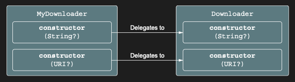

# Secondary constructors: Initializing the superclass in different ways

Genel olarak konuşmak gerekirse, birden fazla constructor’a sahip class’lar Kotlin code’unda Java’ya kıyasla çok daha
az yaygındır. Overloaded constructor’lara ihtiyaç duyacağınız çoğu durum, Kotlin’in default parameter value’ları ve
named argument syntax’ı desteğiyle karşılanır. Argument’lar için overload yapmak ve default value’lar sağlamak amacıyla
birden fazla secondary constructor declare etmeyin. Bunun yerine, default value’ları doğrudan belirtin. Ancak yine de
birden fazla constructor’ın gerekli olduğu durumlar vardır. En yaygın olanı, class’ı farklı şekillerde initialize eden
birden fazla constructor sağlayan bir framework class’ını extend etmeniz gerektiğinde ortaya çıkar. Örneğin, Java’da
declare edilmiş ve biri parameter olarak String, diğeri URI alan iki constructor’a sahip bir Downloader class’ını ele
alalım:

```java
public class DownloaderJava {
    public DownloaderJava(String url) {
        // some code
    }

    public DownloaderJava(URI uri) {
        // some code
    }
}
```

Kotlin’de aynı declaration aşağıdaki gibi görünür:

```kotlin
open class Downloader {
    constructor(url: String?) {
        // some code
    }

    constructor(uri: URI?) {
        // some code
    }
}

class MyDownloader : Downloader {
    constructor(url: String?) : super(url) {
        // some code
    }

    constructor(uri: URI?) : super(uri) {
        // some code
    }
}
```

Downloader class'ı bir primary constructor declare etmez (bunu, class header’ında class adından sonra parantez
olmamasından anlayabilirsiniz), ancak iki secondary constructor declare eder. Bir secondary constructor, constructor
keyword’ü kullanılarak tanımlanır. İhtiyacınız olduğu kadar secondary constructor declare edebilirsiniz. Bu class’ı
extend etmek istiyorsanız, aynı constructor’ları declare edebilirsiniz (MyDownloader)

Burada, her biri super() keyword’ünü kullanarak superclass’ın karşılık gelen constructor’ını call eden iki constructor
tanımlarsınız.



Bir ok, hangi constructor’a delegation yapıldığını gösterir. Java’daki gibi, bir constructor içinden kendi class’ınızın
başka bir constructor’ını this() keyword’ünü kullanarak call etme seçeneğiniz de vardır:

```kotlin
class MyDownloader : Downloader {
    // this Class’ın başka bir constructor’ına delegation yapar
    constructor(url: String?) : this(URI(url))
    constructor(uri: URI?) : super(uri)
}
```

MyDownloader class’ını, constructor’lardan birinin aynı class’ın diğer constructor’ına (this kullanarak) delegation
yapacak şekilde değiştirirsiniz; böylece url string’inden bir URI object’i oluşturulur;


İkinci constructor ise super()’ı call etmeye devam eder. Eğer class’ın bir primary constructor’ı yoksa, her secondary
constructor ya base class’ı initialize etmeli ya da bunu yapan başka bir constructor’a delegation yapmalıdır. Önceki
şekiller açısından düşünürsek, her secondary constructor, base class’ın herhangi bir constructor’ında sona eren bir yol
başlatan dışa doğru bir oka sahip olmalıdır. Secondary constructor’ları kullanmanız gereken başlıca kullanım durumu Java
interoperability’dir. Ancak başka bir olası durum daha vardır: class’ınızın instance’larını farklı parameter
list’leriyle oluşturmanın birden fazla yolu olduğunda. Bunun bir örneğini daha sonra ele alacağız. Nontrivial (önemsiz
olmayan) constructor’ların nasıl tanımlanacağını ele aldık. Şimdi dikkatimizi nontrivial property’lere çevirelim.
