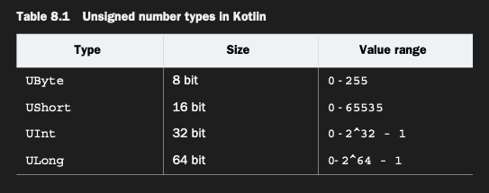

# Using the full bit range to represent positive numbers: Unsigned number types

Pozitif value’ları temsil eden bir integer number’ın tüm bit aralığını kullanman gereken durumlar vardır — örneğin
bit-and-byte seviyesinde çalışırken, bir bitmap’teki pixel’leri, bir file’daki byte’ları veya diğer binary data’yı
manipüle ederken. Bu tür durumlarda Kotlin, Java virtual machine (JVM) üzerindeki normal primitive type’ları unsigned
integer number’lar için type’larla genişletir. Özellikle, table 8.1’de gösterilen dört unsigned number type vardır.

Unsigned number type’lar, signed karşılıklarına compared edildiğinde value range’i “shift” eder ve aynı miktarda memory
içinde daha büyük non-negative number’ları saklamanı sağlar. Örneğin normal bir Int, yaklaşık olarak negatif 2 milyardan
pozitif 2 milyara kadar olan number’ları saklamana izin verir. Buna karşılık bir UInt, 0 ile yaklaşık 4 milyar
arasındaki number’ları represent edebilir:

Unsigned number type’lar value range’i shift eder ve aynı miktarda memory içinde daha büyük non-negative number’ları
saklamana olanak tanır. Normal, signed bir Byte -128 ile 127 arasındaki value’ları saklayabilirken, bir UByte 0 ile 255
arasındaki value’ları saklayabilir.

Diğer primitive type’lar gibi, Kotlin’deki unsigned number’lar da yalnızca gerektiğinde wrapper içine alınır. Aksi
halde, primitive type’ların performance özelliklerine sahiptirler.

Not : Non-negative integer’ların gerekli olduğunu ifade etmek istediğin durumlarda unsigned integer’ları kullanmak cazip
görünebilir. Ancak bu, Kotlin’in unsigned number type’larının amacı değildir. Full bit range’e açıkça ihtiyaç duymadığın
case’lerde, genellikle regular integer’ları kullanmak ve function’ına non-negative bir value’ın geçirildiğini kontrol
etmek daha uygundur.

### Unsigned number types: Implementation details

JVM specification’a (http://mng.bz/nJa4) baktığında, JVM’in kendisinin unsigned number’lar için primitive’ler
tanımlamadığını veya sağlamadığını fark edersin. Kotlin bunu değiştiremez; bu yüzden mevcut signed primitive’lerin
üzerine kendi abstraction’larını sağlar. Bunu, 4.5 bölümünde öğrendiğin bir concept kullanarak yapar: inline class’lar.
Unsigned number’ı temsil eden her class aslında bir inline class’tır ve storage olarak signed karşılığını kullanır.
Evet, doğru: perde arkasında UInt sadece normal bir Int’tir. Kotlin Compiler, mümkün olan her yerde inline class’ları
wrap ettikleri underlying property ile değiştirmeyi üstlendiği için, unsigned number type’larının signed number
type’larıyla eşit performance göstermesini bekleyebilirsin.

___
___

Kotlin Compiler, Int gibi bir type’ı JVM üzerindeki karşılık gelen primitive type’a kolayca dönüştürebilir; çünkü her
iki type da aynı value kümesini temsil edebilir (ve hiçbiri null referans saklayamaz). Benzer şekilde, Kotlin’den bir
Java declaration kullandığında, Java primitive type’lar null value tutamadıkları için non-nullable type’lara (platform
type’lar değil) dönüşür. Şimdi, aynı type’ların nullable versiyonlarını ele alalım.