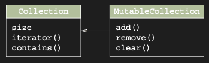

# Read-only and mutable collections

Kotlin’in collection tasarımını Java’dan ayıran önemli bir özellik, collection içindeki data’ya erişim için kullanılan
interface’lerle data’yı değiştirmek için kullanılan interface’leri ayırmasıdır. Bu ayrım, collection’larla çalışmak için
en temel interface olan `kotlin.collections.Collection` ile başlar.

Bu interface’i kullanarak, bir collection’daki element’ler üzerinde iterate edebilir, boyutunu öğrenebilir, belirli bir
element içerip içermediğini kontrol edebilir ve collection’dan veri okuyan diğer operation’ları gerçekleştirebilirsin.
Ancak bu interface’in element eklemek veya çıkarmak için herhangi bir method’u yoktur.

Collection içindeki data’yı değiştirmek için kotlin.collections.MutableCollection interface’ini kullan. Bu interface,
normal kotlin.collections.Collection’ı extend eder ve element ekleme ve çıkarma, collection’ı temizleme gibi method’lar
sağlar. Aşağıda ki resim, iki interface’de defined olan temel method’ları gösterir.

Collections interface read-only’dur. MutableCollection bunu extend eder ve bir collection’ın içeriğini değiştirmek için
method’lar ekler.



Genel bir kural olarak, kodunun her yerinde read-only interface’leri kullanmalısın. Collection’ı değiştirecek kod varsa
yalnızca mutable varyantları kullan.

Val ve var ayrımı gibi, collection’lar için read-only ve mutable interface ayrımı da programındaki data’nın ne durumda
olduğunu anlamayı çok daha kolay hale getirir. Bir function, parameter olarak bir Collection alıyor ama
MutableCollection değilse, collection’ı değiştirmeyecek sadece veri okuyacaktır. Ve bir function MutableCollection
bekliyorsa, veriyi değiştireceğini varsayabilirsin. Eğer collection component’inin internal state’inin bir parçasıysa,
böyle bir function’a geçmeden önce collection’ın bir kopyasını alman gerekebilir. (Bu pattern genellikle defensive copy
olarak adlandırılır.) Örneğin, aşağıdaki copyElements function’ının target collection’ı değiştireceğini ama source
collection’ı değiştirmeyeceğini açıkça görebilirsin.

```kotlin
fun <T> copyElements(
    source: Collection<T>,
    target: MutableCollection<T>
) {
    // Source collection’daki tüm item’lar üzerinde loop oluşturur.
    for (item in source) {
        // Mutable target collection’a item’lar ekler.
        target.add(item)
    }
}

fun main() {
    val source: Collection<Int> = arrayListOf(1, 2, 3, 4)
    val target: MutableCollection<Int> = arrayListOf(1)

    copyElements(source, target)
    println(target) // [1, 1, 2, 3, 4]
}
```

Value’su mutable bir collection olsa bile, read-only collection type’a sahip bir variable’ı target argument olarak
geçemezsin.

```kotlin
fun <T> copyElements(
    source: Collection<T>,
    target: MutableCollection<T>
) {
    // Source collection’daki tüm item’lar üzerinde loop oluşturur.
    for (item in source) {
        // Mutable target collection’a item’lar ekler.
        target.add(item)
    }
}

fun main() {
    val source: Collection<Int> = arrayListOf(1, 2, 3, 4)
    val target: Collection<Int> = arrayListOf(1)

    // Target argument’ta hata oluşur.
    copyElements(source, target)
    // Error: Type mismatch: inferred type is Collection<Int>
    // but MutableCollection<Int> was expected
}
```

Collection interface’larıyla çalışırken akılda tutulması gereken önemli bir fikir, read-only collection’ların mutlaka
immutable olmadığıdır. Read-only interface type’ına sahip bir variable ile çalışıyorsan, bu yalnızca aynı collection’a
işaret eden birçok referanstan biri olabilir. Diğer referanslar mutable interface type’a sahip olabilir:

İki farklı referans, biri read-only diğeri mutable, aynı collection object’e işaret ediyor. list’e erişen kod,
underlying collection’ı değiştiremez, ancak mutableList ile çalışan kodun yaptığı değişikliklerle hâlâ ilgilenmek
zorunda olabilir.


Kodunun bir kısmı collection’a mutable bir referans tutuyorsa, aynı collection üzerinde read-only “view” tutan başka bir
kod parçası, collection’ın ilk kısım tarafından aynı anda değiştirilmediği varsayımına güvenemez. Collection üzerinde
çalışırken collection değiştirildiğinde, ConcurrentModificationException hatalarına ve diğer sorunlara yol açabilir.

Bu nedenle, read-only collection’ların her zaman thread safe olmadığını anlamak önemlidir: function’ının bir collection
üzerinde “view” olarak alabileceği şey, perde arkasında aslında mutable bir collection olabilir. Çok thread’li bir
ortamda data ile çalışıyorsan, kodunun data’ya erişimi doğru şekilde synchronize ettiğinden veya concurrent access’i
destekleyen data structure’lar kullandığından emin olmalısın.

Immutable collection’lar standard library’de mevcut olmasa da, kotlinx.collections.immutable
library (https://github.com/Kotlin/kotlinx.collections.immutable) Kotlin için immutable collection interface’leri ve
implementation prototipleri sağlar.

Read-only ve mutable collection ayrımı nasıl çalışır? Daha önce Kotlin collection’larının Java collection’ları ile aynı
olduğunu söylememiş miydik? Çelişki yok mu? Hadi burada gerçekten neler olduğunu görelim.

### Extra description

"Read-only" (Sadece okunabilir) ile "Immutable" (Asla değiştirilemez) arasındaki fark. Bir listenin List tipinde olması,
o listenin içeriğinin değişmeyeceği anlamına gelmez; sadece senin o referans üzerinden değiştiremeyeceğin anlamına
gelir.

Hadi bunu basit bir örnekle ve günlük hayat benzetmesiyle açıklayalım:

Bir Google Dokümanı düşünün.

* Senin yetkin: Sadece "Görüntüleyici" (Read-only). Sen dokümana tek bir harf bile ekleyemezsin.

* Arkadaşının yetkin: "Düzenleyici" (Mutable). O dokümanı değiştirebilir.

Sen dokümana bakarken (okurken), arkadaşın bir paragrafı siliyor. Sen sayfayı yenilemesen bile doküman değişmiş olur.
İşte bu durumda senin elindeki "salt okunur" görünüm, aslında arkasındaki gerçek veri değiştiği için güncelliğini
yitirir veya hata verir.

Kotlin'de List (read-only) ve MutableList aynı object'e bakabilir:

```kotlin
fun main() {
    val list = mutableListOf(1, 2, 3)
    val view: List<Int> = list

    println(view) // [1, 2, 3]

    // list degisiyor
    list.add(4)

    println(view) // [1, 2, 3, 4]
}
```

Eğer bir thread bu listeyi okuyorsa (for döngüsüyle içinde geziyorsa) ve tam o sırada başka bir thread listeye yeni bir
eleman ekliyorsa, okuma yapan thread patlar.

Neden? Çünkü okuyan thread, listenin sabit olduğunu varsayarak işlem yapar ama altındaki zemin kaymıştır. Bu da meşhur
ConcurrentModificationException hatasına yol açar.

* Yanlış varsayım: "Elimde List var, bu asla değişmez, o yüzden güvendeyim."

* Doğru varsayım : "Elimde bir List var, ben bunu değiştiremem ama başkası (başka bir kod bloğu veya thread) bunu
  değiştiriyor olabilir. Dikkatli olmalıyım."