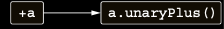
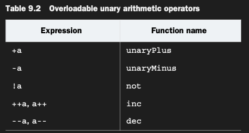

# Operators with only one operand: Overloading unary operators

Unary operator’ü overload etme prosedürü, daha önce gördüğünüzle aynıdır: önceden tanımlanmış bir isimle bir function (
member veya extension) declare edin ve ardından bunu operator modifier ile işaretleyin. Aşağıda bir örneğe bakalım.

```kotlin
operator fun Point.unaryMinus(): Point {
    return Point(-x, -y)
}

fun main() {
    val p = Point(10, 20)
    val minusP = -p
    println(minusP) // Point(x=-10, y=-20)
}
```

Unary operator’leri overload etmek için kullanılan function’lar herhangi bir argument almaz:

Unary + operator’ü, unaryPlus function call’una dönüştürülür:



Unary plus operator’ü de aynı şekilde çalışır. Tablo 9.2, overload edebileceğiniz tüm unary operator’leri listeler.



inc ve dec function’larını, increment ve decrement operator’lerini overload etmek için define ettiğinizde, compiler pre-
ve post-increment operator’leri için, normal number type’larda olduğu aynı semantiği otomatik olarak destekler.
Aşağıdaki örnekte, Java standart kütüphanesindeki BigDecimal class’ı için ++ operator’ü overload edilmiştir.

```kotlin
operator fun BigDecimal.inc() = this + BigDecimal.ONE

fun main() {
    var bigDecimal = BigDecimal.ZERO

    // İlk println statement’ı execute edildikten sonra increment olur.
    println(bigDecimal++) // 0
    println(bigDecimal) // 1
    // İkinci println statement’ı execute edilmeden önce increment olur.
    println(++bigDecimal) // 2
}
```

Postfix ++ operation’ü önce bigDecimal variable’ının mevcut değerini döndürür ve ardından onu artırır; prefix operation
ise bunun tersine çalışır. Yazdırılan değerler, bir Int type’ındaki variable’ı kullansaydınız göreceğiniz değerlerle
aynıdır ve bunu desteklemek için özel bir şey yapmanıza gerek yoktur.