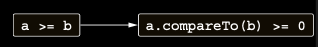

# Ordering operators: compareTo (<, >, ? , and >=)

Java’da, bir class’ın değerleri karşılaştıran algoritmalarda (örneğin maksimumu bulma veya sıralama) kullanılabilmesi
için Comparable interface’ini implement edebilir. Bu interface’de tanımlı compareTo method’u, bir object’in diğerinden
büyük olup olmadığını belirlemek için kullanılır. Ancak Java’da bu method’u çağırmak için kısayol bir syntax yoktur.
Sadece primitive type’lar < ve > kullanılarak karşılaştırılabilir; diğer tüm type’lar için element1.compareTo(element2)
ifadesini açıkça yazmanız gerekir.

Kotlin, aynı Comparable interface’ini destekler. Ancak bu interface’de tanımlı compareTo method’u convention gereği
çağrılabilir ve karşılaştırma operator’lerinin (<, >, <= ve >=) kullanımı compareTo çağrılarına translate edilir:

İki object’in karşılaştırılması, compareTo çağrısının sonucunun sıfır ile karşılaştırılmasına dönüştürülür.



compareTo’nun dönüş type’ı Int olmak zorundadır. p1 < p2 ifadesi, `p1.compareTo(p2) < 0` ifadesiyle eşdeğerdir.
Diğer karşılaştırma operator’leri de tamamen aynı şekilde çalışır.

İki boyutlu point’leri birbirleriyle karşılaştırmak için açıkça doğru bir yol olmadığından, method’un nasıl implement
edilebileceğini göstermek için klasik Person class’ını kullanalım. Implementasyon, adres defteri sıralamasını
kullanacaktır (önce soyadı ile, soyadı aynı ise ad ile karşılaştırma).

```kotlin
class Person(val firstName: String, val lastName: String) : Comparable<Person> {
    override fun compareTo(other: Person): Int {
        // Verilen function veya property referanslarını sırayla evaluate eder ve değerleri karşılaştırır.
        return compareValuesBy(this, other, Person::lastName, Person::firstName)
    }
}

fun main() {
    val p1 = Person("Alice", "Smith")
    val p2 = Person("Bob", "Johnson")
    println(p1 < p2) // false
}
```

Bu case'de, Person object’lerinin yalnızca Kotlin code tarafından değil, collection’ları sıralamak için kullanılan Java
function’ları gibi Java function’ları tarafından da karşılaştırılabilmesi için Comparable interface’ini implement
edersiniz. equals’te olduğu gibi, operator modifier base interface’deki function’a uygulanmıştır; bu nedenle function’ı
override ederken keyword’ü tekrar etmenize gerek yoktur.

Kotlin standart kütüphanesindeki compareValuesBy function’ünü kullanarak compareTo method’unu kolay ve kısa bir şekilde
implement edebileceğinizi unutmayın. Bu function, karşılaştırılacak değerleri hesaplayan selector function’lardan oluşan
bir liste alır. Function, her selector’ü sırayla her iki object için çağırır ve dönüş değerlerini karşılaştırır.
Değerler farklıysa, karşılaştırma sonucunu döndürür. Eğer aynıysa, bir sonraki selector function’a geçer veya çağrılacak
başka function kalmamışsa 0 döndürür. Bu selector’lar lambda olarak veya burada yaptığınız gibi property reference
olarak verilebilir.

Ancak, field'leri elle karşılaştırarak yapılan doğrudan bir implementasyon daha hızlı olurdu; fakat daha fazla code
içerirdi. Her zaman, kısa versiyonu tercih etmeli ve sadece implementasyonun sıkça çağrılacağını biliyorsanız performans
konusunda endişelenmelisiniz. Comparable interface’ini implement eden tüm class’lar, Kotlin’de kısa operator syntax’ı
kullanılarak karşılaştırılabilir. Buna örneğin String de dahildir:

```kotlin
fun main() {
    println("abc" < "bac")
    // true
}
```

Bunun çalışması için herhangi bir extension eklemenize gerek yoktur.