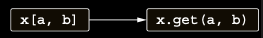

# Accessing elements by index: The get and set conventions

Kotlin’de, element’lere erişimin Java’da array’lere erişimle benzer şekilde — köşeli parantezler aracılığıyla —
yapılabileceğini zaten biliyorsunuz:

```kotlin
val value = map[key]
```

Mutable bir map’te bir key’in değerini değiştirmek için aynı operator’ü kullanabilirsiniz:

```kotlin
mutableMap[key] = newValue
```

Şimdi bunun nasıl çalıştığını görelim. Kotlin’de, indexed access operator bir başka convention’dır. Indexed access
operator kullanarak bir element’i okumak, get operator method’unun çağrılmasına; bir element’e yazmak ise set operator
method’unun çağrılmasına translate edilir. Bu method’lar Map ve MutableMap interface’leri için zaten define edilmiştir.
Kendi class’ınıza benzer method’ları nasıl ekleyeceğinizi görelim.

Kare parantezleri, point’in koordinatlarını refer etmek için kullanmanıza izin vereceksiniz: `p[0]` x koordinatına,
`p[1]` y koordinatına erişmek için. İşte bunları implement etme ve kullanma yolu.

```kotlin
// get adlı bir operator function define eder
operator fun Point.get(index: Int): Int {
    // Verilen index’e karşılık gelen koordinatı alır
    return when (index) {
        0 -> x
        1 -> y
        else -> throw IndexOutOfBoundsException("Invalid coordinate $index")
    }
}

fun main() {
    val p = Point(10, 20)
    println(p[1]) // 20
}
```

Yapmanız gereken tek şey get adlı bir function define etmek ve bunu operator olarak işaretlemektir. Bunu yaptıktan
sonra, p’nin type’ı Point olan `p[1]` gibi expression'lar get method’unun çağrısına translate edilir.

get’in parameter’ı yalnızca Int olmak zorunda değildir; herhangi bir type olabilir. Örneğin, bir map üzerinde indexing
operator’ü kullandığınızda, parameter type map’in key type’ıdır ve bu rastgele bir type olabilir. Ayrıca, birden fazla
parameter alan bir get method’u da define edebilirsiniz. Örneğin, iki boyutlu bir array veya matrix’i represent eden bir
class implement ediyorsanız, `operator fun get(rowIndex: Int, colIndex: Int)` gibi bir method define edebilir ve
`matrix[row, col]` şeklinde çağırabilirsiniz:

Kare parantezler ile erişim, get function call’una dönüştürülür.



Collection’ınız farklı key type’larla erişilebiliyorsa, farklı parameter type’larına sahip birden fazla overloaded get
method’u define edebilirsiniz.

Benzer şekilde, kare parantez syntax’ını kullanarak belirli bir index’teki değeri değiştirmenizi sağlayan bir function
define edebilirsiniz. Point class’ı immutable olduğu için, böyle bir method’u Point için define etmek mantıklı değildir.
Örnek olarak, mutable bir point’i represent eden başka bir class define edelim ve bunu kullanalım.

```kotlin
data class MutablePoint(var x: Int, var y: Int)

// set adlı bir operator function define eder
operator fun MutablePoint.set(index: Int, value: Int) {
    when (index) {
        0 -> x = value
        1 -> y = value
        else ->
            throw IndexOutOfBoundsException("Invalid coordinate $index")
    }
}

fun main() {
    val p = MutablePoint(10, 20)
    p[0] = 11
    p[1] = 22
    println(p) // MutablePoint(x=11, y=22)
}
```

Bu örnek de basittir: indexed access operator’ünün assignment’larda kullanılmasına izin vermek için, yalnızca set adlı
bir function define etmeniz yeterlidir. set’in son parameter’ı, assignment’ın sağ tarafında kullanılan değeri alır ve
diğer argument’ler (Point case’inde yalnızca index) parantez içindeki index’lerden alınır:

Kare parantezler ile yapılan assignment, set function call’una dönüştürülür.

