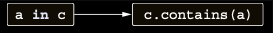

# Checking whether an object belongs to a collection: The in convention

Collection’lar tarafından desteklenen bir diğer operator, bir object’in collection’a ait olup olmadığını kontrol etmek
için kullanılan in operator’üdür. Buna karşılık gelen function, contains olarak adlandırılır. Bunu implement ederek, in
operator’ünü kullanarak bir point’in bir rectangle’a ait olup olmadığını kontrol edebilirsiniz.

```kotlin
data class Point(val x: Int, val y: Int)
data class Rectangle(val upperLeft: Point, val lowerRight: Point)

operator fun Rectangle.contains(p: Point): Boolean {
    // Bir range oluşturur ve x ve y koordinatının bu range’e ait olup olmadığını kontrol eder.
    // < operator’ünü kullanarak açık bir range oluşturur.
    return p.x in upperLeft.x..<lowerRight.x &&
            p.y in upperLeft.y..<lowerRight.y
}

fun main() {
    val rectangle = Rectangle(Point(10, 20), Point(50, 50))
    println(Point(20, 30) in rectangle) // true
    println(Point(5, 5) in rectangle) // false
}
```

in operator’ünün sağ tarafındaki object, contains method’unun çağrıldığı object olur; sol tarafındaki object ise
method’a geçirilen argument olur:

in operator’ü, contains function call’una dönüştürülür.



Rectangle.contains implementasyonunda, açık bir range oluşturmak için ..< operator’ünü kullanır ve ardından bir point’in
bu range’e ait olup olmadığını kontrol etmek için in operator’ünü kullanırsınız. Açık range, bitiş noktasını içermeyen
bir range’dir. Örneğin, 10..20 kullanarak oluşturulan normal (kapalı) range, 10’dan 20’ye kadar tüm sayıları, 20 dahil
olmak üzere içerir. Açık range 10..<20 ise 10’dan 19’a kadar sayıları içerir, ancak 20’yi içermez. Bir rectangle class’ı
genellikle alt ve sağ koordinatları rectangle’ın bir parçası olmayacak şekilde tanımlandığından, burada açık range
kullanımı uygundur.