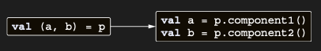

# Making destructuring declarations possible with component functions

Bölüm 4’te data class’ları tartıştığımızda, bazı özelliklerinin daha sonra ortaya çıkacağını belirtmiştik. Artık
conventions ilkesine aşina olduğunuz için son özelliğe bakabiliriz: destructuring declarations. Bu özellik, tek bir
composite value’yu açmanıza ve bunu birkaç ayrı local variable’ı başlatmak için kullanmanıza olanak tanır. İşte nasıl
çalıştığı:

```kotlin
data class Point(val x: Int, val y: Int)

fun main() {
    val p = Point(10, 20)
    val (x, y) = p
    println("x : $x & y : $y") // x : 10 & y : 20
}
```

Bir destructuring declaration, normal bir variable declaration gibi görünür, ancak parantez içinde gruplanmış birden
fazla variable içerir. Alt yapıda, destructuring declaration bir kez daha conventions ilkesini kullanır. Bir
destructuring declaration’daki her variable’ı başlatmak için, declaration içindeki variable’ın konumunu belirten N ile
componentN adlı bir function çağrılır. Başka bir deyişle, önceki örnek şöyle dönüştürülür:

Destructuring declarations, componentN function çağrılarına dönüştürülür.



Bir data class için, compiler, primary constructor’da declared her property için bir componentN function üretir.
Aşağıdaki örnek, bu function’ları non-data class için manuel olarak nasıl declare edebileceğinizi gösterir:

```kotlin
class Point(val x: Int, val y: Int) {
    operator fun component1() = x
    operator fun component2() = y
}
```

Destructuring declarations’ın faydalı olduğu ana use case’lerden biri, bir function’dan birden fazla value döndürmektir.
Bunu yapmanız gerekirse, döndürmeniz gereken value’ları tutmak için bir data class declare edebilir ve bunu function’ın
return type’ı olarak kullanabilirsiniz. Destructuring declaration syntax’ı, function’ı çağırdıktan sonra value’ları
açmayı ve kullanmayı kolaylaştırır. Bunu göstermek için, bir filename’i name ve extension olarak ayıran basit bir
function yazalım.

```kotlin
// Value’ları tutmak için bir data class declare eder
data class NameComponents(val name: String, val extension: String)

fun splitFileName(fullName: String): NameComponents {
    val result = fullName.split(".", limit = 2)

    // Function’dan data class’ın bir instance’ını return eder
    return NameComponents(result[0], result[1])
}

fun main() {
    // Class’ı açmak için destructuring declaration syntax’ını kullanır
    val (name, ext) = splitFileName("example.kt")
    println("Name : $name, extension : $ext") // Name : example, extension : kt
}
```

ComponentN function’larının array’ler ve collection’lar üzerinde de defined olduğunu fark ederseniz, bu örneği daha da
geliştirebilirsiniz. Bu, bilinen bir boyuttaki collection’larla çalışırken faydalıdır—ve bu, split’in iki element’ten
oluşan bir list return etmesiyle böyle bir durumdur.

```kotlin
// Value’ları tutmak için bir data class declare eder
data class NameComponents(val name: String, val extension: String)

fun splitFileName(fullName: String): NameComponents {
    val (name, extension) = fullName.split(".", limit = 2)
    return NameComponents(name, extension)
}

fun main() {
    val (name, ext) = splitFileName("example.kt")
    println("Name : $name, extension : $ext") // Name : example, extension : kt
}
```

Elbette, bu türden sonsuz sayıda componentN function declare etmek mümkün değildir, böylece syntax arbitrary sayıda item
ile çalışabilseydi de bu kullanışlı olmazdı. Standard library, bu syntax’ı bir container’ın ilk beş element’ine erişmek
için kullanmanıza izin verir.

Bir function’dan birden fazla value return etmenin daha basit bir yolu, standard library’den Pair ve Triple class’larını
kullanmaktır. Bu, kendi class’ınızı define etmekten daha az code gerektirebilir, ancak return edilen object’te ne
bulunduğunu açıkça göstermediği için kodunuzdaki değerli expressiveness’tan da vazgeçmiş olursunuz.