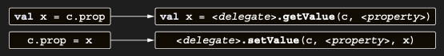

# Delegated properties are translated to hidden properties with custom accessors

Delegated property’lerin nasıl çalıştığına dair kuralları özetleyelim. Delegated property’ye sahip bir class’ınız
olduğunu varsayalım:

```kotlin
class C {
    var prop: Type by MyDelegate()
}

val c = C
```

MyDelegate instance’ı, <delegate> olarak adlandıracağımız gizli bir property’de saklanır. Compiler ayrıca property’yi
represent etmek için KProperty type’ında bir object kullanır; bu object’e <property> diyeceğiz.

Compiler aşağıdaki code’u generate eder:

```
class C {
    private val <delegate> = MyDelegate()
    
    var prop: Type
        get() = <delegate>.getValue(this, <property>)
        set(value: Type) = <delegate>.setValue(this, <property>, value)
}
```

Dolayısıyla, her property accessor’ının içinde compiler, aşağıda gösterildiği gibi ilgili getValue ve setValue
method’larına çağrılar generate eder.

Bir property’ye eriştiğinizde, <delegate> üzerindeki getValue ve setValue function’ları çağrılır.



Bu mekanizma oldukça basittir, ancak birçok ilginç senaryoyu mümkün kılar. Property’nin value’sunun nerede saklanacağını
(bir map’te, bir database table’da veya bir user session’ın cookie’lerinde) ve property’ye erişildiğinde ne olacağını
(validation eklemek, change notification’ları yapmak vb.) customize edebilirsiniz. Tüm bunlar compact code ile
gerçekleştirilebilir. Standard library’de delegated property’ler için bir kullanım örneğine daha bakalım ve ardından
bunları kendi framework’lerinizde nasıl kullanabileceğinizi görelim.