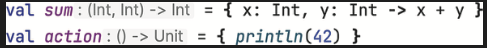
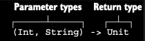
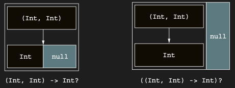

# Function types specify the parameter types and return values of a lambda

Bir lambda’yı argument olarak alan bir function declare edebilmek için, ilgili parameter’ın type’ını nasıl declare
edeceğini bilmen gerekir. Buna geçmeden önce, daha basit bir case’e bakalım ve bir lambda’yı local bir variable’da
saklayalım. Kotlin’in type inference’ına güvenerek type’ı declare etmeden bunu nasıl yapabileceğini zaten gördün:

```kotlin
fun main() {
    val sum = { x: Int, y: Int -> x + y }
    val action = { println(42) }
}
```

Bu case’te Compiler, hem sum hem de action variable’larının function type’larına sahip olduğunu infer eder (IDE’in bunu
görselleştirmene yardımcı olabilir)



Şimdi, bu variable’lar için explicit bir type declaration’ın nasıl göründüğüne bakalım:

```kotlin
val sum: (Int, Int) -> Int = { x, y -> x + y }
val action: () -> Unit = { println(42) }
```

Bir function type declare etmek için, function parameter type’larını parantez içine koyar, ardından bir ok işareti ve
function’ın return type’ını yazarsın:



Chapter 8’de hatırlayacağın gibi, Unit type’ı bir function’ın anlamlı bir value return etmediğini belirtmek için
kullanılır. Normal bir function declare ederken Unit return type’ı atlanabilir, ancak bir function type declaration’ı
her zaman explicit bir return type gerektirir; bu nedenle bu context’te Unit’i atlayamazsın.

Lambda expression’daki `{ x, y -> x + y }` içinde x ve y parameter’larının type’larını nasıl atlayabildiğine dikkat et.
Çünkü bunlar, variable declaration’ın bir parçası olarak function type’ta belirtilmiştir; bu nedenle lambda’nın
kendisinde tekrar etmene gerek yoktur.

Diğer tüm function’larda olduğu gibi, bir function type’ın return type’ı nullable olarak işaretlenebilir:

```kotlin
val canReturnNull: (Int, Int) -> Int? = { x, y -> null }
```

Bir function type’a sahip nullable bir variable da define edebilirsin. Nullable olanın function’ın return type’ı değil,
variable’ın kendisi olduğunu belirtmek için, tüm function type tanımını parantez içine alman ve soru işaretini kapanış
parantezinden sonra koyman gerekir:

```kotlin
val funOrNull: ((Int, Int) -> Int)? = null
```

Bu örnek ile bir önceki arasındaki ince farka dikkat et. Parantezleri atlarsan, nullable return type’a sahip bir
function type declare etmiş olursun; function type’a sahip nullable bir variable declare etmiş olmazsın:

Parantezler, bir function type’ın nullable bir return type’a mı sahip olduğunu yoksa kendisinin mi nullable olduğunu
belirler.



Sol taraf -> İki integer alan ve nullable bir integer return eden bir function

Sağ taraf -> İki integer alan ve non-null bir integer return eden nullable bir function