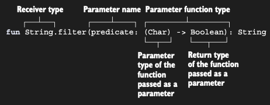

# Calling functions passed as arguments

Artık Kotlin’de local bir variable içinde bir functional type’ı nasıl specify edeceğini bildiğine göre, bir higher-order
function’ı nasıl implement edeceğimizi tartışalım. İlk örnek mümkün olduğunca basittir ve daha önce gördüğün sum
lambda’sı ile aynı type declaration’ını kullanır. Function, 2 ve 3 olmak üzere iki sayı üzerinde arbitrary bir operation
gerçekleştirir ve sonucu print eder.

```kotlin
fun twoAndThree(operation: (Int, Int) -> Int) {
    val result = operation(2, 3)
    println("Result : $result")
}

fun main() {
    twoAndThree { a, b -> a + b } // Result : 5
    twoAndThree { a, b -> a * b } // Result : 6
}
```

Argument olarak geçirilen function’ı call etme syntax’ı, normal bir function’ı call etmekle aynıdır: function isminin
ardından parantezleri koyar ve parameter’ları parantezlerin içine yazarsın.

### Parameter names of function types

Bir function type’ın parameter’ları için isimler specify edebilirsin:

```kotlin
// Function type artık named parameter’lara sahiptir.
fun twoAndThree(operation: (operandA: Int, operandB: Int) -> Int) {
    val result = operation(2, 3)
    println("Result : $result")
}

fun main() {
    // API’de sağlanan isimleri lambda argument name’leri olarak kullanabilirsin…
    twoAndThree { operandA, operandB -> operandA + operandB }

    // … veya onları değiştirebilirsin.
    twoAndThree { alpha, beta -> alpha * beta }
}
```

Parameter name’leri type matching’i etkilemez. Lambda declare ederken, function type declaration’da kullanılan aynı
parameter name’lerini kullanmak zorunda değilsin. Ancak, isimler code’un readability’sini artırır ve IDE’de code
completion için kullanılabilir.

Daha ilginç bir örnek olarak, en çok kullanılan standard library function’larından biri olan filter function’ı yeniden
implement edelim. Filter’ı daha önce 6. chapter’da kullanmıştın, ancak şimdi onun inner workings ile ilgilenme zamanı.
İşleri basit tutmak için, filter function’ı String üzerinde implement edeceksin; ancak herhangi bir element collection’ı
üzerinde çalışan generic version da benzer şekilde çalışır. Filter function declaration’ı:



Filter function, bir predicate’i parameter olarak alır. Predicate’in type’ı, bir character parameter alan ve Boolean
result return eden bir function’dır. Predicate, belirli bir character için true return ederse, bu character sonuç
string’inde yer almalıdır. False return ederse, dahil edilmemelidir. İşlem bittikten sonra size filtrelenmiş yeni bir
String döndürür. (Orijinal string değişmez, Kotlin'de stringler immutable yani değiştirilemezdir).Function, şu şekilde
implement edilebilir.

Filter function implementation’ı basittir. Her character’ın predicate’i satisfy edip etmediğini kontrol eder. Bunu
sağlayan character’lar için, buildString tarafından sağlanan StringBuilder’ın append function’ını kullanır (chapter 5’te
öğrendiğin gibi), sonucu kademeli olarak oluşturur ve ardından return eder. Bu, özellikle daha önce 9. chapter’da
gördüğün iterator convention sayesinde oldukça basittir; böylece String üzerinde diğer Kotlin collection’ları gibi
iterate edebilirsin.

Hem extension function hem de buildString function bir receiver define ettiği için, buildString lambda’sının
receiver’ı (bir StringBuilder instance’ı) yerine filter function’ın outer receiver’ına (input string) erişmek için
labeled this expression kullanırsın. Labeled this expression’a daha sonra daha yakından bakacaksın.

```kotlin
fun String.filter(predicate: (Char) -> Boolean): String {
    return buildString {
        // Input string üzerinde character character iterate eder.
        for (char in this@filter) {
            // Predicate parameter’ı için argument olarak geçirilen function’ı çağırır.
            if (predicate(char)) append(char)
        }
    }
}

fun main() {
    // Predicate için argument olarak bir lambda geçirir.
    val text = "ab1c".filter { it in 'a'..'z' }
    println(text) // abc

    // Predicate için argument olarak bir lambda geçirir.
    val secretCode = "AbCdeFGhi".filter {it.isUpperCase()}
    println(secretCode) // ACFG
}
```


