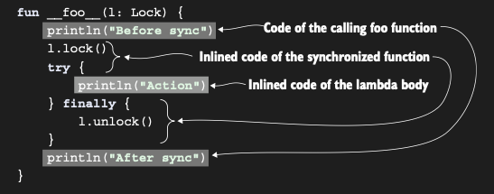

# Inlining means substituting a function body to each call site

Bir function’ı inline olarak declare ettiğinizde, body’si inline edilir — başka bir deyişle, function normal şekilde
invoke edilmek yerine, çağrıldığı yerlere doğrudan yerleştirilir. Ortaya çıkan code’u anlamak için bir örneğe bakalım.
Aşağıdaki function, paylaşılan bir resource’un birden fazla thread tarafından aynı anda erişilmesini engellemek için
kullanılabilir. Function, bir Lock object’i kilitler, verilen code bloğunu çalıştırır ve ardından lock’u serbest
bırakır.

```kotlin
// inline olarak işaretlenmiş bir function’ın body’si, function’ın çağrıldığı yerlere yerleştirilir.
inline fun <T> synchronized(lock: Lock, action: () -> T): T {
    lock.lock()
    try {
        return action()
    } finally {
        lock.unlock()
    }
}

fun main() {
    val l = ReentrantLock()
    synchronized(l) {
        //...
    }
}
```

Bu function’ı çağırma syntax’ı, Java’daki synchronized statement’ını kullanmaya tamamen benzer. Fark şudur: Java
synchronized statement’ı herhangi bir object ile kullanılabilirken, bu function bir Lock instance’ı geçirmenizi
gerektirir. Burada gösterilen definition yalnızca bir örnektir; Kotlin standard library, argument olarak herhangi bir
object kabul eden bir synchronized implementation’ı da define eder.

Ancak synchronization için explicit lock’lar kullanmak, daha güvenilir ve maintainable code sağlar. Section 10.2.5’te,
verilen action’ı bir lock altında çalıştırmak için tercih etmeniz gereken Kotlin standard library’deki withLock
function’ını tanıtacağız.

synchronized function’ını inline olarak declare ettiğiniz için, ona yapılan her call için üretilen code, Java’daki bir
synchronized statement için üretilen code ile aynıdır. synchronized() kullanımına dair şu örneği göz önünde bulundurun:

```kotlin
fun foo(l: Lock) {
    println("Before sync")
    synchronized(l) {
        println("Action")
    }
    println("After sync")
}
```

Alttaki resim, aynı bytecode’a compile edilecek eşdeğer code’u gösterir. Inlining’in, synchronized function’ın
implementation’ının yanı sıra lambda expression’a da uygulandığına dikkat edin. Lambda’dan üretilen bytecode, çağıran
function’ın definition’ının bir parçası haline gelir ve bir function interface’ini implement eden anonymous class içine
sarılmaz.



Ayrıca, bir inline function’ı çağırmak ve bir variable’dan bir function type parameter’ı geçirmek de mümkündür:

```kotlin
inline fun <T> synchronized(lock: Lock, action: () -> T): T {
    lock.lock()
    try {
        return action()
    } finally {
        lock.unlock()
    }
}

class LockOwner(val lock: Lock) {
    fun runUnderLock(body: () -> Unit) {
        // Bir function type türünde bir variable, lambda değil, argument olarak geçirilir.
        synchronized(lock, body)
    }
}
```

Bu case de, lambda’nın code’u inline function’ın çağrıldığı yerde mevcut değildir; bu nedenle inline edilmez. Yalnızca
synchronized function’ın body’si inline edilir — lambda her zamanki gibi call edilir. runUnderLock function’ı, aşağıdaki
function’a benzer bir bytecode’a compile edilir.

```kotlin
class LockOwner(val lock: Lock) {
    // Bu function, gerçek runUnderLock’un compile edildiği bytecode’a benzerdir.
    fun __runUnderLock__(body: () -> Unit) {
        lock.lock()
        try {
            // Body inline edilmez, çünkü invocation’da bir lambda yoktur.
            body()
        } finally {
            lock.unlock()
        }
    }
}
```

Bir inline function’ı farklı yerlerde farklı lambda’larla iki kez kullanırsanız, her call site bağımsız olarak inline
edilir. Inline function’ın code’u, kullandığınız her iki konuma da kopyalanır ve her birine farklı lambda’lar
yerleştirilir.

Function’lara ek olarak, property accessor’larınızı (get, set) da inline olarak işaretleyebilirsiniz. Bu, Kotlin’in
reified generic’lerinden yararlanırken faydalı hale gelir. Örnekleri ve ayrıntılarını chapter 11’de ele alacağız.

### Extra description

Basitçe söylemek gerekirse: inline anahtar kelimesini kullandığında, derleyici o fonksiyonu bir "call" (jump) olarak
değil, kodun o noktaya "kopyalanıp yapıştırılması" olarak işler.

* Normal Fonksiyon (Kopyalamaz, Çağırır):

Sen bir fonksiyonu call ettiğinde program o fonksiyonun olduğu adrese zıplar, işi bitirir ve geri döner. Eğer parametre
olarak bir lambda gönderiyorsan, arka planda bir FunctionN object'i oluşturulur.

* Inline Fonksiyon (Kopyalar):

Compiler, fonksiyonun gövdesini alır ve fonksiyonun çağrıldığı her yere direkt olarak o kod satırlarını yazar.

```kotlin
inline fun debugLog(block: () -> Unit) {
    println("Log started")
    block()
    println("Log done!")
}
fun main() {
    debugLog {
        println("Action started")
        // Log started
        // Action started
        // Log done!
    }
}
```

Arka planda (Bytecode'da) olan şudur: Compiler main içindeki debugLog çağrısını siler ve yerine fonksiyonun gövdesini (
body) yapıştırır:

```kotlin
fun main() {
    println("Log started")
    println("Action started")
    println("Log done!")
}
```

Neden inline Kullanırız?

* Performans: Hatırlarsan lambdalar arka planda birer nesne (FunctionN) oluşturuyordu. inline kullandığında bu nesne
  oluşturma süreci tamamen ortadan kalkar. Bellek (RAM) ve işlemci yükü azalır.

* Non-local Returns: Normal bir lambdanın içinden main fonksiyonunu return ile bitiremezsin. Ama inline fonksiyonlarda
  lambda içinden direkt return yapabilirsin, çünkü kod zaten main'in içine yapıştırılmış durumdadır.

* Reified Type Parameters: Normal fonksiyonlarda Generic tipler (T) çalışma anında silinir. inline sayesinde T tipinin
  ne olduğunu çalışma anında bilebilirsin (reified).

Her fonksiyonu inline yapmak iyi bir fikir değildir. Çünkü:

* Kod Şişmesi (Code Bloat): Eğer fonksiyonun gövdesi çok büyükse ve sen bu fonksiyonu projenin her yerinde çağırıyorsan,
  kopyala-yapıştır mantığı nedeniyle uygulamanın boyutu (APK/Jar boyutu) gereksiz yere büyür.

* Küçük Fonksiyonlar: İçinde lambda parametresi olmayan basit fonksiyonları inline yapmak genelde anlamsızdır; JIT
  derleyicisi zaten bunları otomatik optimize eder.

Inline function body, fonksiyonun çağrıldığı yere derleme aşamasında enjekte edilen kod parçasıdır. Amacı, yüksek
seviyeli fonksiyonlardaki (Higher-order functions) lambda nesnesi oluşturma maliyetini sıfıra indirmektir.