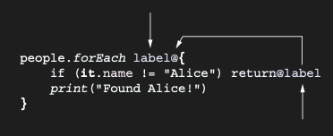

# Returning from lambdas: Return with a label

Lambda expression’dan local return da yazabilirsiniz. Local return, lambda’nın execution’ını durdurur ve lambda’nın
çağrıldığı code’un execution’ına devam eder. Local return ile non-local return’u ayırt etmek için, chapter 2’de kısaca
gördüğünüz label’ları kullanırsınız. Return etmek istediğiniz lambda’yı label ile işaretleyebilir ve return
keyword’ünden sonra bu label’a referans verebilirsiniz. Bu örnekte, input collection people içindeki tüm element’ler
üzerinde iterate etmek için forEach kullanılır ve name property’si "Alice" olmayan element’leri atlamak için labeled
return kullanılır.

```kotlin
data class Person(val name: String, val age: Int)

val people = listOf(
    Person("Alice", 29),
    Person("Bob", 31)
)

fun lookForAlice(people: List<Person>) {
    // Lambda expression’ı label’lar
    people.forEach label@{
        // return@label, bu label’a referans verir.
        if (it.name != "Alice") return@label
        // Bu satır yalnızca return execute edilmediğinde yazdırılır.
        println("Found Alice")
    }
}

fun main() {
    lookForAlice(people) // Found Alice
}
```

Lambda expression’ı label’lamak için, label adını (herhangi bir identifier olabilir) lambda’nın açılış süslü
parantezinden önce @ karakteri ile birlikte yazın. Lambda’dan return etmek için, return keyword’ünden sonra @ karakteri
ve label adını yazın:



Alternatif olarak, bu lambda’yı argument olarak alan function’ın adı label olarak kullanılabilir.

```kotlin
fun lookForAlice(people: List<Person>) {
    // Lambda expression’ı label’lar
    people.forEach {
        // return@label, bu label’a referans verir.
        if (it.name != "Alice") return@forEach
        // Bu satır yalnızca return execute edilmediğinde yazdırılır.
        println("Found Alice")
    }
}
```

Lambda expression’ın label’ını açıkça belirtirseniz, function adı ile label kullanımı işe yaramaz. Bir lambda
expression, birden fazla label’a sahip olamaz.

### Labeled this expressions

Aynı kurallar, this expression’larının label’ları için de geçerlidir. Chapter 5’te, receiver’ı olan lambda’ları — lambda
içinde this reference ile erişilebilen implicit bir receiver object içeren lambda’ları — tartıştık. (Chapter 13,
argument olarak receiver’lı lambda bekleyen kendi function’larınızı nasıl yazacağınızı açıklayacak.) Eğer receiver’lı
bir lambda’nın label’ını belirtirseniz, ilgili labeled this expression ile onun implicit receiver’ına erişebilirsiniz:

```kotlin
fun main() {
    // Bu lambda’nın implicit receiver’ına this@sb ile erişilir.
    println(StringBuilder().apply sb@{
        listOf(1, 2, 3).apply { // this, scope’daki en yakın implicit receiver’a referans verir.
            // Tüm implicit receiver’lara erişilebilir; dıştaki olanlara explicit label’lar aracılığıyla.
            this@sb.append(this.toString())
        }
    })
    // [1, 2, 3]
}
```

Return expression’larındaki label’larda olduğu gibi, lambda expression’ın label’ını açıkça belirtebilir veya bunun
yerine function adını kullanabilirsiniz.

___
___

Non-local return syntax’i oldukça ayrıntılıdır ve bir lambda birden fazla return expression içeriyorsa kullanımı
zahmetli hale gelir. Bir çözüm olarak, code bloklarını geçirmek için alternatif bir syntax kullanabilirsiniz: anonymous
function’lar.