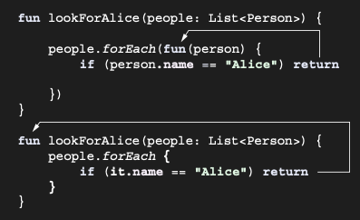

# Anonymous functions: Local returns by default

Anonymous function, lambda expression yazmanın başka bir syntactic form’udur. Bu nedenle, anonymous function’ları
kullanmak, diğer function’lara geçirilebilen code blokları yazmanın bir başka yoludur. Ancak, return expression’ları
kullanma şekli açısından farklılık gösterirler. Gelin bunu daha yakından inceleyelim ve bir örnekle başlayalım.

```kotlin
data class Person(val name: String, val age: Int)

val people = listOf(
    Person("Alice", 29),
    Person("Bob", 31)
)

fun lookForAlice(people: List<Person>) {
    // Lambda expression yerine anonymous function kullanır
    people.forEach(fun(person) {
        if (person.name == "Alice") return // return, en yakın function’a refer eder: **anonymous function**.
        println("${person.name} is not Alice")
    })
}

fun main() {
    lookForAlice(people) // Bob is not Alice
}
```

Bir **anonymous function**, normal bir function’a benzer; farkı, adının olmaması ve parameter type’larının infer
edilebilmesidir. İşte bir başka örnek.

```kotlin
people.filter(fun(person): Boolean {
    return person.age < 30
})
```

Anonymous fonksiyonlar, return type belirtme konusunda regular fonksiyonlarla aynı kuralları izler. Yukarıdaki code'da
ki gibi block body’ye sahip Anonymous fonksiyonlarda return type’ın explicitly belirtilmesi gerekir. expression body
kullanırsan return type’ı atlayabilirsin.

```kotlin
people.filter(fun(person) = person.age < 30)
```

Bir anonymous fonksiyonun içinde, label içermeyen bir return expression, enclosing olan fonksiyondan değil anonymous
fonksiyondan döner. Kural basittir: return, fun keyword kullanılarak declared edilmiş en yakın fonksiyondan döner.
Lambda expressions fun keyword’ü kullanmaz; bu nedenle bir lambda içindeki return, outer fonksiyondan döner. Anonymous
fonksiyonlar ise fun kullanır; dolayısıyla önceki örnekte anonymous fonksiyon en yakın eşleşen fonksiyondur. Sonuç
olarak return expression, enclosing olandan değil anonymous fonksiyondan döner:



Bir anonymous fonksiyon, regular bir fonksiyon declaration’ına benzemesine rağmen, lambda expression’ın başka bir
sözdizimsel formudur. Genel olarak, kitap boyunca şimdiye kadar gördüğün lambda sözdizimini kullanacaksın. Anonymous
fonksiyonlar, lambda sözdizimi kullanıldığında label verilmesi gereken çok sayıda erken return statement içeren kodu
kısaltmaya özellikle yardımcı olur.

Lambda expressions’ın nasıl implemented edildiği ve inline fonksiyonlar için nasıl inline edildikleriyle ilgili
tartışma, anonymous fonksiyonlar için de geçerlidir.