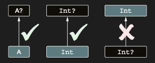

# Understanding the differences between classes, types, and subtypes

7.3 bölümünde tartıştığımız gibi, bir variable’ın type’ı bu variable için olası value’ları belirtir. Bazen type ve class
terimlerini birbirinin yerine kullandık, ancak bunlar aynı şey değildir—ve şimdi aralarındaki farkı inceleme zamanı.

En basit durumda, nongeneric bir class ile, class’ın adı doğrudan bir type olarak kullanılabilir. Örneğin,
`var x: String` yazarsan, String class’ının instance’larını tutabilen bir variable declare etmiş olursun. Ancak aynı
class adının nullable bir type declare etmek için de kullanılabildiğine dikkat et: `var x: String?`. Bu, her Kotlin
class’ının en az iki type oluşturmak için kullanılabileceği anlamına gelir.

Generic class’lar söz konusu olduğunda durum daha da karmaşık hale gelir. Geçerli bir type elde etmek için, class’ın
type parameter’ı yerine spesifik bir type’ı type argument olarak koyman gerekir. List tek başına bir type değildir (bir
class’tır), ancak aşağıdaki tüm substitution’lar geçerli type’lardır: List<Int>, List<String?>, List<List<String>> ve
benzerleri. Her generic class, potansiyel olarak sonsuz sayıda type üretir.

Type’lar arasındaki ilişkiyi tartışabilmemiz için, subtype terimine aşina olman gerekir. Bir B type’ı, eğer A type’ından
bir value gerektiğinde B type’ından bir value kullanabiliyorsan, A type’ının bir subtype’ıdır. Örneğin, Int, Number’ın
bir subtype’ıdır; ancak Int, String’in bir subtype’ı değildir. Bu tanım ayrıca bir type’ın kendisinin de bir subtype’ı
olarak kabul edildiğini gösterir: Supertype terimi, subtype’ın tersidir. Eğer A, B’nin bir subtype’ıysa, o zaman B de
A’nın bir supertype’ıdır.

Bir B type’ı, A beklendiğinde kullanılabiliyorsa, A’nın bir subtype’ıdır. Number beklendiğinde Int kullanılabildiği
için, Int bir subtype’tır. Aynı şekilde, Int beklendiğinde de Int kullanılabilir; dolayısıyla kendisinin de bir
subtype’ıdır. String beklendiğinde Int kullanılamadığı için, Int bir subtype olarak kabul edilemez.


Bir type’ın başka bir type’ın subtype’ı olup olmaması neden önemlidir? Compiler, bir value’yu bir variable’a assign
ettiğinde veya bir function’a argument olarak geçirdiğinde bu kontrolü her seferinde yapar. Aşağıdaki örneği ele alalım.

```kotlin
fun test(i: Int) {
    val n: Number = i // Int, Number’ın bir subtype’ı olduğu için compile olur

    fun f(s: String) {
        //...
    }
    f(i) // Int, String’in bir subtype’ı olmadığı için compile olmaz
}
```

Bir value’yu bir variable’da saklamak, yalnızca value type’ı variable type’ının bir subtype’ı olduğunda izinlidir;
örneğin, initializer i’nin type’ı olan Int, variable type’ı Number’ın bir subtype’ı olduğu için n’nin declaration’ı
geçerlidir. Bir expression’ı bir function’a geçirmek de yalnızca expression’ın type’ı function parameter type’ının bir
subtype’ı olduğunda izinlidir. Bu örnekte, argument i’nin type’ı olan Int, function parameter’ı olan String’in bir
subtype’ı değildir; bu nedenle f function’ının invocation’ı compile olmaz.

Basit case'lerde, subtype esasen subclass ile aynı anlama gelir. Örneğin, Int class’ı Number’ın bir subclass’ıdır;
dolayısıyla Int type’ı da Number type’ının bir subtype’ıdır. Bir class bir interface’i implement ediyorsa, onun type’ı
interface type’ının bir subtype’ıdır: String, CharSequence’in bir subtype’ıdır.

Nullable type’lar, subtype’ın subclass ile aynı olmadığı bir duruma örnek sağlar:

Non-null bir A type’ı, nullable A?’nin bir subtype’ıdır; ancak tersi geçerli değildir: Int? beklendiğinde Int
kullanabilirsin, fakat Int beklendiğinde Int? kullanamazsın.



Non-null bir type, onun nullable versiyonunun bir subtype’ıdır; ancak her ikisi de tek bir class’a karşılık gelir.
Non-nullable bir type’ın value’sunu her zaman nullable bir type’taki bir variable’da saklayabilirsin, fakat tersi mümkün
değildir (null, non-nullable bir type’taki bir variable için kabul edilebilir bir value değildir). Bu da non-nullable
type’ı nullable type’ın bir subtype’ı yapar.

```kotlin
fun main() {
    val s: String = "abc"
    val t: String? = s // Bu assignment geçerlidir çünkü String, String?’nin bir subtype’ıdır.
}
```

Subclass’lar ile subtype’lar arasındaki fark, generic type’lar hakkında konuşmaya başladığımızda özellikle önem kazanır.
Önceki bölümdeki, List<Any> bekleyen bir function’a List<String> type’ında bir variable geçirmenin güvenli olup olmadığı
sorusu artık subtype açısından yeniden ifade edilebilir: List<String>, List<Any>’nin bir subtype’ı mıdır?

MutableList<String>’i MutableList<Any>’nin bir subtype’ı olarak ele almanın neden güvenli olmadığını gördün. Açıkça,
bunun tersi de doğru değildir: MutableList<Any> de MutableList<String>’in bir subtype’ı değildir.

Bir generic class — örneğin MutableList — type parameter üzerinde **invariant** olarak adlandırılır; eğer herhangi iki
farklı type A ve B için, MutableList<A> ne MutableList<B>’nin bir subtype’ı ne de bir supertype’ı ise. Java’da tüm
class’lar invariant’tır (değişmez) (her ne kadar bu class’ların spesifik kullanımları non-invariant olarak
işaretlenebiliyor olsa da; bunu yakında göreceksin).

Önceki bölümde, subtype kuralları farklı olan bir class gördün: List. Kotlin’deki List interface’i read-only bir
collection’ı temsil eder. Eğer A, B’nin bir subtype’ıysa, o zaman List<A>, List<B>’nin de bir subtype’ıdır. Bu tür class
veya interface’lere **covariant** denir. Bir sonraki bölüm, covariance kavramını detaylı şekilde ele alır ve bir class
veya interface’i ne zaman covariant olarak declare etmenin mümkün olduğunu açıklar.