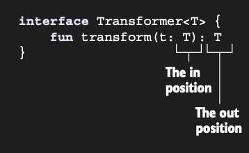

# Covariance preserves the subtyping relation

Covariant bir class, aşağıdakinin geçerli olduğu bir generic class’tır (örnek olarak `Producer<T>` kullanacağız): A,
B’nin bir subtype’ıysa, `Producer<A>` da `Producer<B>`’nin bir subtype’ıdır. Buna subtyping’in korunduğunu söyleriz.
Örneğin, Cat, Animal’ın bir subtype’ı olduğu için, `Producer<Cat>`, `Producer<Animal>`’ın bir subtype’ıdır.

Bu kavram, özellikle Java, C# veya Kotlin gibi dillerle uğraşırken karşımıza çıkan, object oriented programlamanın en
önemli ama kafa karıştırıcı kurallarından biridir.

Covariance (Eşyönlülük) kavramını daha iyi anlamak için konuyu üç adımda inceleyelim:

1 - Temel Mantık: Subtype İlişkisinin Korunması:

Normal şartlarda, Cat bir Animal ise, bir Cat nesnesini Animal bekleyen her yere gönderebilirsiniz. Ancak işin içine
Generic yapılar (Listeler, Producer'lar vb.) girdiğinde durum değişir.

2 - Neden Producer Deniyor?

Bu isimlendirme tesadüf değildir. Bir sınıfın güvenli bir şekilde covariant olabilmesi için genellikle dışarıya veri
çıkışı yapması (produce etmesi) gerekir.

Diyelim ki elinizde bir Producer<Cat> var. Bu nesne size sürekli Cat veriyor.

Siz bir `Producer<Animal>` bekliyorsanız ve size `Producer<Cat>` verilirse, aldığınız her Cat aynı zamanda bir Animal
olduğu için programınız hata vermeden çalışmaya devam eder.

Bu yüzden "produce" aşamasında subtype ilişkisini korumak güvenlidir.

Kotlin’de bir class’ı belirli bir type parameter üzerinde covariant olarak declare etmek için, type parameter adının
önüne **out** keyword’ünü koyarsın.

```kotlin
// Bu class, T üzerinde covariant olarak declare edilmiştir.
interface Producer<out T> {
    fun produce(): T
}
```

Bu ifade, compiler'a şu garantiyi verir: "Bu sınıf T tipini sadece dışarıya verir (return eder), asla dışarıdan içeriye
almaz.". out T yazdığınızda, Kotlin compiler'ı sınıfın içindeki tüm fonksiyonları denetler. Eğer T tipini bir fonksiyona
parametre olarak almaya çalışırsanız compiler hata verir.

```kotlin
interface Producer<out T> {
    fun produce(): T        // ✅ GEÇERLİ: T tipi dışarı çıkıyor (out)
    // fun consume(item: T) // ❌ HATA: T tipi içeri giremez!
}
```

Bu kısıtlama sayesinde type safety korunur. Çünkü bir Cat listesine Dog eklenmesini bu şekilde engellemiş olursunuz.

Bir class’ın type parameter’ını covariant olarak işaretlemek, type argument’lar function tanımındakilerle birebir
eşleşmediğinde bile, bu class’ın value’larını function argument’ı ve return value olarak geçirmeyi mümkün kılar.
Örneğin, Herd class’ı tarafından temsil edilen bir hayvan grubunu beslemekten sorumlu bir function hayal et. Herd
class’ının type parameter’ı, sürüdeki Animal'ın type’ını belirtir.

```kotlin
open class Animal {
    fun feed() { /* ... */
    }

    // Type parameter covariant olarak declare edilmemiştir.
    class Herd<T : Animal> {
        val size: Int get() = {/* ... */ }
        operator fun get(i: Int): T { /* ... */
        }
    }

    fun feedAll(animal: Herd<Animal>) {
        for (i in 0..<animal.size) {
            animal[i].feed()
        }
    }
}
```

Diyelim ki kodunun bir kullanıcısının bir Cat sürüsü var ve onlarla ilgilenmesi gerekiyor.

```kotlin
// A Cat bir Animal'dır
class Cat : Animal() {
    fun cleanLitter() {
        println("Cat litter cleaned")
    }
}

fun takeCareOfCats(cats: Herd<Cat>) {
    for (i in 0..<cats.size) {
        cats[i].cleanLitter()
    }
    feedAll(cats)
    // Error: inferred type is Herd<Cat>,
    // but Herd<Animal> was expected.
}
```

Normalde her Cat bir Animal olduğu için bu işlemin çok doğal görünmesi gerekir. Ancak Kotlin (ve Java gibi diller),
generic parametreleri varsayılan olarak Invariant (Değişmez) kabul eder. Yani compiler şöyle der: "Sen benden
Herd<Animal> istedin ama bana Herd<Cat> veriyorsun. Bunlar farklı tiplerdir, Cat'in Animal olması beni ilgilendirmez."

feedAll fonksiyonu parametre olarak şunu bekliyor: `fun feedAll(animals: Herd<Animal>`)

Burada Animal tam olarak belirtildiği için, compiler sadece ve sadece `Herd<Animal>` kabul eder. İçinde Cat, Dog veya
Lion olan bir sürüyü buraya gönderemezsiniz. Bu durum kodun tekrar kullanılabilirliğini (reusability) ciddi şekilde
kısıtlar. Eğer Herd sınıfını sadece Animal "veren" (yani içindeki hayvanları okuduğumuz) bir sınıf olarak tasarladıysak,
sınıf tanımına out ekleyerek bu sorunu çözeriz:

Artık feedAll fonksiyonu şu şekilde çalışabilir:

* Ona bir `Herd<Cat>` gönderdiğinizde, içinden çıkan her şeyin en azından bir Animal olduğundan emin olur.

* Cat mi, Dog mu olduğu önemli değildir; çünkü feed() metodu her türlü Animal için geçerlidir.

out kullandığımızda, Herd sınıfının içine dışarıdan yeni bir eleman ekleyemeyiz. Örneğin add(item: T) gibi bir fonksiyon
yazmamıza compiler izin vermez.

Ne yazık ki kediler aç kalacaktır; sürüyü feedAll function’ına geçirmeye çalışsaydın, compile sırasında bir
type-mismatch hatası alırdın. Herd class’ındaki T type parameter’ı üzerinde herhangi bir variance modifier kullanmadığın
için, onu invariant (Değişmez) yapmış oluyorsun; bu da Cat sürüsünün Animal sürüsünün bir subtype’ı olmaması anlamına
gelir.

Bu problemi aşmak için explicit bir cast kullanabilirdin, ancak bu yaklaşım hem verbose’tur, hem error-prone’dur hem de
bir type-mismatch problemiyle başa çıkmanın neredeyse hiçbir zaman doğru bir yolu değildir.

Herd class’ı, List’e benzer bir API’ye sahip olduğu ve client’larının sürüdeki hayvanları add etmesine veya change
etmesine izin vermediği için, onu covariant yapabilir ve çağıran code’u buna göre değiştirebilirsin.

```kotlin
class Herd<out T : Animal> { // T parameter’ı artık covariant’tır.
    /* ... */
}

fun takeCareOfCats(cats: Herd<Cat>) {
    for (i in 0..<cats.size) {
        cats[i].cleanLitter()
    }
    feedAll(cats) // Cast’e ihtiyaç yoktur.
}
```

Her class’ı covariant yapamazsın, çünkü bu unsafe olur. Bir class’ı belirli bir type parameter üzerinde covariant
yapmak, bu type parameter’ın class içindeki olası kullanımlarını sınırlar. Type safety’yi garanti etmek için, bu
parameter yalnızca out position olarak adlandırılan yerlerde kullanılabilir; yani class T type’ında value’lar
üretebilir, ancak onları consume edemez.

Class member’larının declaration’larında bir type parameter’ın kullanımları in ve out position’lara ayrılabilir. T adlı
bir type parameter declare eden ve T’yi kullanan bir function içeren bir class’ı ele alalım. Eğer T bir function’ın
return type’ı olarak kullanılıyorsa, bunun out position’da olduğunu söyleriz. Bu case’te function, T type’ında value’lar
üretir. Eğer T bir function parameter’ının type’ı olarak kullanılıyorsa, bu in position’dadır. Böyle bir function, T
type’ında value’ları consume eder:

Bir generic parameter’ın nerede kullanıldığına bağlı olarak, bulunduğu position farklı şekilde adlandırılır. Function
parameter type `in` position olarak adlandırılır ve function return type `out` position olarak adlandırılır.



Bir sınıftaki generic type (T), verinin akış yönüne göre ikiye ayrılır:

* Out (Çıkış) Pozisyonu: Fonksiyonun geri dönüş değeri (return type) kısmıdır. Veri sınıftan dışarıya, kullanıcıya doğru
  akar.

    * `fun produce(): T` → T burada out pozisyonundadır.

* In (Giriş) Pozisyonu: Fonksiyonun parametrik kısmıdır. Data kullanıcıdan sınıfın içine doğru akar.

    * `fun consume(t: T)` → T burada in pozisyonundadır.

Yukarıda ki resimdeki interface'e bakalım:

Burada T tipi hem "in" hem de "out" pozisyonunda kullanılmış.

* Parametre olarak alındığı için: in

* Return değeri olduğu için: out

Bu sınıfa out T yazarak onu covariant yapmaya çalışırsan Kotlin compiler hata verecektir. Çünkü out demek, "Bu tip
sadece dışarı çıkacak" demektir; ama burada içeriye de giriyor.

Sonuç olarak: Bir sınıfı out ile işaretlediğinde, Kotlin senin o tipi fonksiyonlara parametre olarak yazmanı yasaklar.
Böylece tip güvenliğini (Type Safety) garanti altına alır.

Bir class’ın type parameter’ı üzerindeki out keyword’ü, T’yi kullanan tüm method’ların T’yi yalnızca out position’larda
kullanmasını ve in position’larda kullanmamasını gerektirir. Bu keyword, T’nin olası kullanımını sınırlar ve buna
karşılık gelen subtype relation’ın safety’sini garanti eder.

Örnek olarak Herd class’ını ele alalım. Bu class, type parameter T’yi yalnızca tek bir yerde kullanır: get method’unun
return value’sunda.

```kotlin
class Herd<out T : Animal> {
    val size: Int
        get() = {/**/ }

    operator fun get(i: Int): T { /* ... */
    } // T’yi return type olarak kullanır
}
```

Bir sınıfa out T dediğinde, Kotlin compiler sınıfa bir "bekçi" diker. Bu bekçi şunu kontrol eder: "T tipi,
fonksiyonların parantez içinde (input) mı duruyor, yoksa parantezin dışında (output) mı?"

Eğer sınıfa şunu eklemeye çalışsaydın:

```kotlin
fun addAnimal(animal: T) { /*...*/
} // T burada INPUT (in) pozisyonunda
```

Compiler hemen hata verecektir: "Type parameter T is declared as 'out' but occurs in 'in' position."

Bu bir out position’dır ve bu da class’ı covariant olarak declare etmeyi safe hâle getirir. `Herd<Animal>` üzerinde
get’i call eden herhangi bir code, method bir Cat döndürüyorsa sorunsuz çalışır; çünkü Cat, Animal’ın bir subtype’ıdır.

Tekrar etmek gerekirse, type parameter T üzerindeki out keyword’ü iki anlama gelir:

* Subtype relation korunur (`Producer<Cat>`, `Producer<Animal>`’ın bir subtype’ıdır).

* T yalnızca out position’larda kullanılabilir.

Şimdi List<T> interface’ine bakalım. List, Kotlin’de read-only’dir; bu nedenle T type’ında bir element döndüren get adlı
bir method’a sahiptir, ancak list içine T type’ında bir value koyan herhangi bir method define etmez. Bu yüzden o da
covariant’tır.

```kotlin
interface List<out T> : Collection<T> {
    operator fun get(index: Int): T
    // ...
}
```

Bir type parameter yalnızca doğrudan parameter type’ı veya return type olarak değil, aynı zamanda başka bir type’ın type
argument’ı olarak da kullanılabilir. Örneğin, List interface’i List<T> döndüren subList adlı bir method içerir.

```kotlin
interface List<out T> : Collection<T> {
    // Burada da T out position’dadır.
    fun subList(fromIndex: Int, toIndex: Int): List<T>
    // ...
}
```

Bu case’te, subList function’ındaki T out position’da kullanılır.

Yani bir tipin "out" pozisyonunda olup olmadığını anlamak için sadece fonksiyona değil, o tipin içinde bulunduğu "zarfa"
da bakmak gerekir. Eğer bir fonksiyon T tipini doğrudan değil de, başka bir yapının (örneğin bir List) içinde
döndürüyorsa, T hala out pozisyonundadır. Burada T tipi, dönüş değeri olan `List<T>`'nin içindedir.

* Fonksiyonun dönüş tipi (Return Type) = Out Pozisyonu.

* `List<T`> bir bütün olarak dışarı çıktığı için, onun içindeki T de dolaylı yoldan out pozisyonundadır.

Eğer T tipi, bir fonksiyonun parametresinin içindeyse durum değişir:

```kotlin
interface Processor<out T> {
    // HATA! T burada "in" pozisyonundadır.
    // Çünkü bir Listenin içinde olsa bile, o liste fonksiyonun "input" parametresidir.
    fun process(items: List<T>)
}
```

* T tipi, dışarı giden bir geminin (return) içindeyse → OUT (Güvenli)

* T tipi, içeri gelen bir geminin (parameter) içindeyse → IN (Güvensiz)

Kotlin compiler'i sadece en üst seviyeye bakmaz; tipin fonksiyon imzasındaki "derinliğine" de bakar. Eğer o tip, en
nihayetinde kullanıcıya bir değer sunmak için kullanılıyorsa (yani dönüş tipinin bir parçasıysa), out kurallarına uymaya
devam eder.

`MutableList<T>`’yi type parameter’ı üzerinde covariant olarak declare edemezsin; çünkü T type’ında value’lar parameter
olarak alan ve aynı zamanda bu value’ları döndüren method’lar içerir (dolayısıyla T hem in hem de out position’larda yer
alır). Compiler bu kısıtlamayı enforce eder. Aşağıdaki code, interface’i out keyword’ü aracılığıyla covariant olarak
declare etmeye çalışır ve şu error’ı rapor eder: **Type parameter T is declared as ‘out’ but occurs in the ‘in’ position
**.

```kotlin
//MutableList, T üzerinde (out keyword’ü aracılığıyla) covariant olarak declare edilemez …
interface MutableList<out T>
    : List<T>, MutableCollection<T> {
    override fun add(element: T): Boolean
    // … çünkü T in position’da kullanılır (T, bir function parameter’ının type’ı olarak kullanılır).
}
```

Constructor parameter’larının ne in ne de out position’da olduğunu unutma. Bir type parameter out olarak declare edilmiş
olsa bile, onu bir constructor parameter declaration’ında yine de kullanabilirsin:

```kotlin
class Herd<out T : Animal>(vararg animals: T) { /* ... */ }
```

Normalde out olarak işaretlenmiş bir tipi, bir fonksiyonun parantezi içinde (input) göremezsiniz demiştik. Ancak
Constructor (Yapıcı Metot) bu kuralın dışındadır. Bir sınıfın constructor'ı, object creation aşamasında çağrılır. Nesne
bir kez yaratıldıktan sonra, constructor tekrar çağrılamaz. Eğer T tipini constructor parametresi olarak kullanırsanız,
bu sadece nesne oluşturulurken veri girişi olduğu anlamına gelir. Nesne oluşturulduktan sonra, bu T tipi eğer out
kısıtlamalarına uyuyorsa (yani dışarıdan erişilebilir bir var property değilse), tip güvenliğini bozacak bir durum
oluşmaz. Burada çok önemli bir detay var. Constructor içinde T tipini kullanırken property tanımlayıp tanımlamadığınız
her şeyi değiştirir:

* Sadece Parametre: `class Herd<out T>(animals: T)` → GÜVENLİ. Çünkü bu veri sadece başlatma anında kullanılır ve bir
  daha dışarıdan erişilemez.

* val Property: `class Herd<out T>(val leader: T)` → GÜVENLİ. Çünkü val sadece okunabilir (read-only). Bu, T tipinin
  sadece "out" pozisyonunda (getter metodu ile) olduğu anlamına gelir.

* var Property: `class Herd<out T>(var leader: T)` → HATA! İşte burada compiler dur der. Çünkü `var` demek, hem bir
  getter (out) hem de bir setter (in) demektir. setter olduğu anda içeriye yanlış tipte veri sızabilir.

Variance, bir class instance’ını daha generic bir type’ın instance’ı olarak kullandığında yanlış kullanıma karşı korur;
potansiyel olarak tehlikeli method’ları call edemezsin. Constructor, instance creation’dan sonra call edilebilen bir
method değildir; bu nedenle potansiyel olarak tehlikeli olamaz.

Ancak bir constructor parameter ile birlikte val veya var keyword’ünü kullanırsan, aynı zamanda bir getter ve (property
mutable ise) bir setter da declare etmiş olursun. Bu nedenle type parameter, read-only bir property için out
position’da, mutable bir property için ise hem out hem de in position’larda kullanılır:

```kotlin
class Herd<T : Animal>(var leadAnimal: T, vararg animals: T) { /* ... */ }
```

Bu case’te T out olarak işaretlenemez; çünkü class, leadAnimal property’si için T’yi in position’da kullanan bir setter
içerir.

Ayrıca position kurallarının yalnızca bir class’ın dışarıdan görülebilen (public, protected ve internal) API’sini
kapsadığını unutma. Private method’ların parameter’ları ne in ne de out position’dadır. Variance kuralları, bir class’ı
dış client’lar tarafından yanlış kullanıma karşı korur ve class’ın kendi implementation’ı içinde devreye girmez:

```kotlin
class Herd<out T : Animal>(
    private var leadAnimal: T,
    vararg animals: T
) { /* ... */ }
```

Artık Herd’ü T üzerinde covariant yapmak safe’tir; çünkü leadAnimal property’si private yapılmıştır. Type parameter’ın
yalnızca in position’da kullanıldığı class veya interface’lerde ne olduğunu merak edebilirsin. Bu durumda ters ilişki
geçerlidir. Bir sonraki bölüm ayrıntıları sunar.