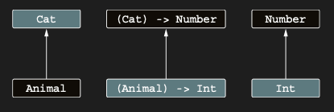

# Contravariance reverses the subtyping relation

Contravariance kavramı, covariance’ın bir aynası olarak düşünülebilir: contravariant bir class için subtype relation,
type argument olarak kullanılan class’ların subtype relation’larının tersidir. Bir örnekle başlayalım: Comparator
interface’i. Bu interface, verilen iki object’i compare eden compare adlı tek bir method define eder:

```kotlin
interface Comparator<in T> {
    // T’yi in position’larda kullanır
    fun compare(e1: T, e2: T): Int { /* ... */
    }
}
```

Bu interface’in method’unun yalnızca T type’ında value’ları consume ettiğini görebilirsin. Bu, T’nin yalnızca in
position’larda kullanıldığı anlamına gelir; dolayısıyla declaration’ı in keyword’ü ile başlatılabilir.

Belirli bir type için tanımlanmış bir comparator, elbette o type’ın herhangi bir subtype’ının value’larını da compare
edebilir. Örneğin, weight adlı ortak bir property’yi paylaşan apples ve oranges’tan oluşan basit bir fruits hiyerarşin
olabilir:

```kotlin
sealed class Fruit {
    abstract val weight: Int
}

data class Apple(override val weight: Int, val color: String) : Fruit()

data class Orange(override val weight: Int, val juicy: Boolean) : Fruit()
```

Eğer şimdi bir `Comparator<Fruit>` oluşturursan, bunu herhangi bir spesifik type’ın value’larını compare etmek için
kullanabilirsin:

```kotlin
sealed class Fruit {
    abstract val weight: Int
}

data class Apple(override val weight: Int, val color: String) : Fruit()

data class Orange(override val weight: Int, val juicy: Boolean) : Fruit()

fun main() {
    val weightComparator = Comparator<Fruit> { a, b ->
        a.weight - b.weight
    }

    val fruits: List<Fruit> = listOf(
        Apple(100, "Green"),
        Orange(180, true)
    )

    val apples: List<Apple> = listOf(
        Apple(50, "red"),
        Apple(120, "green"),
        Apple(155, "yellow")
    )

    /* weight comparator’ünü, apples ve oranges gibi Fruit’un bir subtype’ı olan object’lerin herhangi bir collection’ı
    için kullanabilirsin. */
    println(fruits.sortedWith(weightComparator))
    // [Apple(weight=100, color=Green), Orange(weight=180, juicy=true)]

    println(apples.sortedWith(weightComparator))
    // [Apple(weight=50, color=red), Apple(weight=120, color=green), Apple(weight=155, color=yellow)]
}
```

sortedWith function’ı bir `Comparator<String>` (string’leri compare edebilen bir comparator) bekler ve daha general
type’ları compare edebilen bir comparator’ü geçirmek safe’tir. Belirli bir type’taki object’ler üzerinde comparison
yapman gerekiyorsa, o type’ı ya da onun herhangi bir supertype’ını handle eden bir comparator kullanabilirsin. Bu,
Any’nin String’in bir supertype’ı olduğu durumda, `Comparator<Any>`’nin `Comparator<String>`’in bir subtype’ı olduğu
anlamına gelir. İki farklı type için comparator’ler arasındaki subtype relation, bu type’lar arasındaki subtype
relation’ın ters yönündedir.

Artık contravariance’ın tam tanımı için hazırsın. Bir type parameter üzerinde contravariant olan bir class, generic bir
class’tır (örnek olarak `Consumer<T>`’yi ele alalım) ve bunun için şu durum geçerlidir: B, A’nın bir subtype’ıysa,
`Consumer<A>`, `Consumer<B>`’nin bir subtype’ıdır. Type argument’lar A ve B yer değiştirmiştir; bu yüzden subtype
relation’ın tersine döndüğünü söyleriz. Örneğin, `Consumer<Animal>`, `Consumer<Cat>`’in bir subtype’ıdır.

Aşağıdaki resim, bir type parameter üzerinde covariant ve contravariant olan class’lar için subtype relation arasındaki
farkı gösterir. Producer class’ı için subtype relation, type argument’larının subtype relation’ını aynen yansıtırken,
Consumer class’ı için bu ilişkinin tersine döndüğünü görebilirsin.

Covariant bir type olan Producer<T> için subtype relation korunur; ancak contravariant bir type olan Consumer<T> için
subtype relation tersine çevrilir.


in keyword’ü, karşılık gelen type’taki value’ların bu class’ın method’larına geçirildiği ve bu method’lar tarafından
consume edildiği anlamına gelir. Covariant case’e benzer şekilde, type parameter’ın kullanımını kısıtlamak belirli bir
subtype relation’a yol açar. Type parameter T üzerindeki in keyword’ü, subtype relation’ın tersine çevrildiği ve T’nin
yalnızca in position’larda kullanılabileceği anlamına gelir. Table 11.1, olası variance seçimleri arasındaki farkları
özetler.


Covariant -> `Producer<out T>` ->  Class için subtype relation korunur: `Producer<Cat>`, `Producer<Animal>`’ın bir
subtype’ıdır. T yalnızca out position’larda kullanılır.

Contravariant -> `Consumer<in T>` -> Subtype relation tersine çevrilir: `Consumer<Animal>`, `Consumer<Cat>`’in bir
subtype’ıdır. T yalnızca in position’larda kullanılır.

Invariant -> `MutableList<T>` -> Subtype relation yoktur. T herhangi bir position’da kullanılabilir

Bir class veya interface, bir type parameter üzerinde covariant, başka bir type parameter üzerinde contravariant
olabilir. Klasik örnek Function interface’idir. Aşağıdaki declaration, tek parameter’lı bir Function’ı gösterir:

```kotlin
interface Function1<in P, out R> {
    operator fun invoke(p: P): R
}
```

Kotlin gösterimi olan `(P) -> R`, `Function1<P, R>`’yi ifade etmenin başka ve daha okunabilir bir biçimidir. P’nin (
parameter type) yalnızca in position’da kullanıldığını ve in keyword’ü ile işaretlendiğini, R’nin (return type) ise
yalnızca out position’da kullanıldığını ve out keyword’ü ile işaretlendiğini görebilirsin. Bu, function type için
subtype relation’ın ilk type argument için tersine çevrildiği, ikinci type argument için ise korunduğu anlamına gelir.
Örneğin, cat’lerini enumerate etmeye çalışan bir higher-order function’ın varsa, herhangi bir animal’ı kabul eden bir
lambda geçebilirsin:

```kotlin
fun enumerateCats(f: (Cat) -> Number) { /* ... */
}

fun Animal.getIndex(): Int = {/* ... */ }

fun main() {
    // Bu code Kotlin’de legaldir. Animal, Cat’in bir supertype’ıdır ve Int, Number’ın bir subtype’ıdır.
    enumerateCats(Animal::getIndex)
}
```

Aşağıdaki resim, önceki örnekteki subtype relation’larını gösterir.

Function `(T) -> R`, argument’ı üzerinde contravariant’tır (subtype relation’ı tersine çevirir) ve return type’ı
üzerinde covariant’tır (subtype relation’ı korur).



Şimdiye kadarki tüm örneklerde, bir class’ın variance’ı doğrudan declaration’ında belirtilir ve class’ın kullanıldığı
tüm yerler için geçerli olur. Java bunu desteklemez; bunun yerine, bir class’ın belirli kullanımları için variance’ı
belirtmek üzere wildcard’lar kullanır. Şimdi bu iki yaklaşım arasındaki farka bakalım ve ikinci yaklaşımı Kotlin’de
nasıl kullanabileceğini görelim.

Yukarıdaki örneği anlamlı bir hale getirmeye çalıştım;

```kotlin
open class Animal
class Cat : Animal()

/* enumerateCats şunu şart koşuyor: "Bana bir fonksiyon ver, bu fonksiyon bir Cat alsın ve bana bir Number versin."
Tipi: (Cat) -> Number */
fun enumerateCats(f: (Cat) -> Number) {
    val myCat = Cat()
    val result = f(myCat)
    println("$result")
}

// Girdi: Bir Animal nesnesi. Çıktı bir int değeri. sembolik olarak 42 yazdım
// Yani bu fonksiyonun tipi aslında şudur: (Animal) -> Int.
fun Animal.getIndex(): Int = 42

fun main() {
    enumerateCats(Animal::getIndex)
}
```