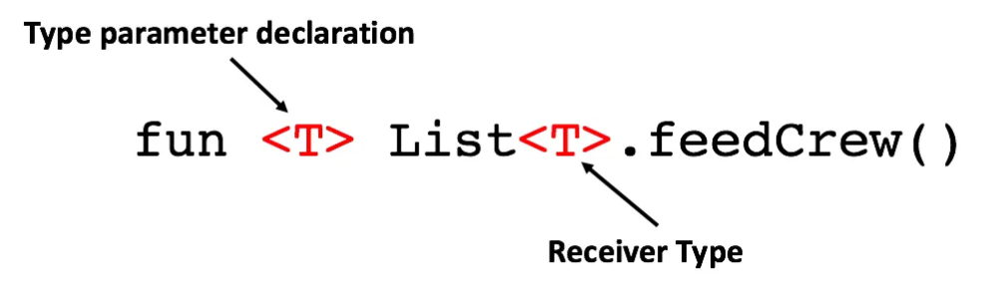

# Extra description

Covariant - Contravariant - Invariant

Yazılım dünyasında bu terimler (özellikle C#, Java veya TypeScript gibi dillerde), tipler arasındaki alt-üst
ilişkisinin (inheritance), bu tiplerden türetilen karmaşık yapılar (Listeler, Fonksiyonlar, Genericler) arasında nasıl
korunacağını belirler.

### Temel Kural: Substitution

Her Cat bir Animal'dır. Dolayısıyla, bir Animal beklenen yere Cat gönderebilirsin. Bu normaldir. Ama bir `List<Animal>`
beklenen yere `List<Cat>` gönderebilir misin? İşte bu sorunun cevabı bu üç terimden geçer.

1 - Covariance (Eşyönlülük)

"Aynı yönde değişim" demektir. Eğer Cat, Animal'ın subtype'ı ise;

`Collection<Cat>` de `Collection<Animal>`'ın subtype'ı sayılır.

Ne zaman kullanılır? Genellikle Output (Çıktı) işlemlerinde. Örnek: Bir metodun "Animal" döndürmesi gerekiyorsa, "Cat"
döndürmesi bir sorun yaratmaz. Çünkü dışarıdan bakan kişi "Animal" alacağını bilir ve Cat de zaten bir hayvandır.

2 - Contravariance (Tersyönlülük)

"Ters yönde değişim" demektir. Tip hiyerarşisinin tam tersine dönmesidir. Ne zaman kullanılır? Genellikle Input (
Girdi/Parametre) işlemlerinde. Örnek: Bir fonksiyonun "Cat" üzerinde işlem yapması gerekiyorsa (`Action<Cat>`), ona "tüm
Animalları" besleyebilen bir fonksiyon (`Action<Animal>`) verebilirsin. Neden? Çünkü `Action<Animal>` her türlü animal
ile başa çıkabiliyorsa, içine Cat koyduğunda da hata vermeyecektir. Ama tersi tehlikelidir; her Animal'ı besleyen bir
yere sadece cat besleyen bir fonksiyonu "animal feed" diye kandırıp gönderemezsin (çünkü oraya Lion da gelebilir!).

3 - Invariance (Değişmezlik)

Hiçbir esneklik yoktur. Tip neyse o olmak zorundadır. Subtype'ı veya Supertype'ı kabul edilmez. Ne zaman kullanılır? Hem
okuma hem yazma yapılan durumlarda (Örn: `List<T>`). Neden? Eğer `List<Animal> list = new List<Cat>();` yapılmasına izin
verilseydi (invaryant olmasaydı), ben o listeye `list.Add(new Dog())` diyerek Dog ekleyebilirdim. Ama liste aslında
`List<Cat>` olduğu için çalışma zamanında sistem çökerdi. Bu riski önlemek için listeler genelde invarianttır.

___
___

Kotlin’de class’lar ile type’lar arasındaki farkı ele alarak başlayalım. Kotlin’de bu iki kelimeyi sık sık duyduğumuzda,
bazen birbirlerinin yerine kullanıldıklarını görebiliriz; ancak aslında bu kelimeler arasında farklar vardır!

Kotlin’de bir type, bir object kümesinin paylaşabileceği property’leri tanımlar ve bu da programmer’ın data’yı nasıl
kullanmayı amaçladığını Compiler’a bildirir. Bir Kotlin class’ı ise bu type’ın yalnızca bir implementation’ıdır. Bunun
anlamı şudur: Bir class her zaman bir type’tır, ancak bir type her zaman bir class olmak zorunda değildir.

Örneğin bu non-generic Sloth class’ını ele alalım:

```kotlin
data class Sloth(val name: String, val isTwoFingered: Boolean) {
    fun eat() {}
    fun sleep() {}
}
```

Bu sloth pek bir şey yapmıyor. Peki Sloth bir class mı yoksa bir type mı? Aslında ikisi de; çünkü bir class’tır ama aynı
zamanda type’ın adıdır. Peki variable’larda saklanan Sloth type’ları ne olacak?

* `var jerryTheSloth: Sloth`, Sloth class’ının bir instance’ını tutan bir variable declare eder.

* `var jerryTheSloth: Sloth?`, Jerry the Sloth’un nullable bir type olarak da declare edilebileceğini gösterir. Her
  Kotlin class’ı en az 2 type oluşturmak için kullanılabilir!

### Generics Type Parameters

Kotlin’de Lists, Sets ve Maps gibi görebileceğin birçok generic collection’da olduğu gibi, collection içinde object’ler
bulunduğu sürece type argument’lar Kotlin Compiler tarafından infer edilebilir.

```kotlin
// Sloth -> tembel hayvan
data class Sloth(val name: String, val isTwoFingered: Boolean) {
    fun eat() {}
    fun sleep() {}
}

val slotCrew = listOf(
    Sloth("Jerry", false),
    Sloth("Bae", true),
    Sloth("Chrissy", false),
)
```

Empty collection’lar için ise, type’ın açıkça define edilmesi gerekir; ya … ile

```kotlin
val slothReg: List<Sloth> = listOf()
```

yada;

```kotlin
val slothReg = listOf<Sloth>()
```

### Generic Functions

Sloth ekibimiz var, ancak hepsinin aynı anda beslenmesini istiyoruz. Function’ımızı bir Sloth listesi alacak şekilde
yazabiliriz:

```kotlin
data class Sloth(val name: String, val isTwoFingered: Boolean) {
    fun eat() {}
    fun sleep() {}
}

fun feedCrew(crew: List<Sloth>) {
    crew.forEach { it.eat() }
}
```

Her şey güzel, ancak ya partiye bir panda ekibi de katılsaydı ve onları da beslememiz gerekseydi? Bu durumda aynı
function’ı Sloth’lar için kullanamazdık; dolayısıyla Pandas için benzer bir function yazmamız gerekirdi.

```kotlin
data class Panda(val name: String) {
    fun eat() {}
    fun sleep() {}
}

fun feedCrew(crew: List<Panda>) {
    crew.forEach { it.eat() }
}
```

Eğer aynı şeyi yapıyorlarsa, bu function’ı tek bir tanede birleştirmeyi deneyemez miydik? Herhangi bir list ile çalışmak
için Generic function’lar kullanma olasılığına bakalım. List type’ını extend eden generic bir feedCrew() function’ı
yazabilir ve kullandığımızda type’ı parameter’da define edebilirdik.



Sorun şu ki, bu function içinde aslında eat() call’unu yapamayız. Bunun nedeni, compiler açısından bakıldığında tüm List
type’larının bir eat() function’ına sahip olmamasıdır. Burada, function’ımızı ve data class’larımızı, bu iki class’ın
bir Mammal class’ından subtype olarak inherit edecek şekilde yazabiliriz.

```kotlin
open class Mammal(val name: String) {
    fun eat() {}
    fun sleep() {}
}

data class Sloth(val slothName: String, val isTwoFingered: Boolean) : Mammal(slothName)

data class Panda(val pandaName: String) : Mammal(pandaName)

// list<out E>, element type’ı üzerinde covariant’tır.
fun feedCrew(crew: List<Mammal>) {
    crew.forEach { it.eat() }
}

fun main() {
    val slothCrew = listOf(
        Sloth("Jerry", false),
        Sloth("Bae", true),
        Sloth("Chrissy", false)
    )

    val pandaCrew = listOf(
        Panda("Jay"),
        Panda("Peggy")
    )

    feedCrew(slothCrew)
    feedCrew(pandaCrew)
}
```

### Covariance & Contravariance

Bu gerçekten neden çalışıyor? feedCrew için parameter’daki List üzerinde Cmd + Click yaparsan, signature’ı görürüz.

```kotlin
public actual interface List<out E> : Collection<E>
```

list’in element type’ı üzerinde covariant olduğu yerde. Covariant bir class, subtype relation’ın korunduğu generic bir
class’tır. Covariant bir class’ın type parameter’ını covariant yapmak, type argument’lar function definition’dakilerle
tam olarak eşleşmediğinde bile bu class’ın value’larını function argument’ları ve return value’lar olarak geçmeyi mümkün
kılar. Daha spesifik olarak, eşleşmedikleri durumda bu type argument’ların kabul edilme kriteri, tanımlı type
argument’ın en azından bir subtype’ı olmalarıdır.

Kotlin’de bir class’ı belirli bir type parameter üzerinde covariant olarak declare etmek için, element type’ı üreten
type parameter’ın adından önce out keyword’ünü koyarsın. Elbette covariance’ta bu ilişki yalnızca tek yönde geçerlidir.
“Bir Panda, bir Mammal’ın bir subtype’ıdır” diyebiliriz; ancak bir Mammal’ın bir Sloth olduğunu söyleyemeyiz.


Class için subtype relation korunur: `Producer<Sloth/Panda>`, `Producer<Mammal>`’ın bir subtype’ıdır.

Contravariance ise, bunun tersine, covariance’ın bir yansımasıdır.


Class için subtype relation tersine çevrilir: `Consumer<Mammal>`, `Consumer<Sloth/Panda>`’nın bir subtype’ıdır.

Kotlin’de bir class’ı belirli bir type parameter üzerinde contravariant olarak declare etmek için, element type’ı
consume etmek üzere type parameter’ın adından önce `in` keyword’ünü koyarsın.

Diyelim ki tüm ekibi bir araya toplamak ve isimleri alfabetik sıraya göre sort etmek istedik. Bunu yapabilmek için
Comparator interface’ini kullanabiliriz:

```
interface Comparator<in T> {
    fun compare(e1: T, e2: T): Int {}
```

Code içindeki implementation işte bu şekilde görünür!

```kotlin
open class Mammal(val name: String) {
    fun eat() {}
    fun sleep() {}
}

data class Sloth(val slothName: String, val isTwoFingered: Boolean) : Mammal(slothName)

data class Panda(val pandaName: String) : Mammal(pandaName)

fun main() {
    // Burada ki list compiler tarafından infer edildiğinde List<Mammal> olur
    val crewList = listOf(
        Sloth("Jerry", false),
        Sloth("Bae", true),
        Sloth("Chrissy", false),
        Panda("Jay"),
        Panda("Peggy")
    )

    val compareByNames = Comparator{a : Mammal, b: Mammal ->
        a.name.first().code - b.name.first().code
    }

    println(crewList.sortedWith(compareByNames))
    /* [Sloth(slothName=Bae, isTwoFingered=true), Sloth(slothName=Chrissy, isTwoFingered=false),
    Sloth(slothName=Jerry, isTwoFingered=false), Panda(pandaName=Jay), Panda(pandaName=Peggy)]*/
}
```