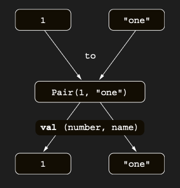

    # Working with pairs: Infix calls and destructuring declarations

Map oluşturmak için mapOf function’ını kullanırsın:

```kotlin
val map = mapOf(1 to "one", 2 to "two", 7 to "seven")
```

Bu code satırındaki **to** kelimesi built-in bir construct değildir; özel bir türde method invocation’dır: infix
call. Bir infix call’da, method adı target object adı ile parameter arasına, herhangi bir ek ayraç olmadan
yerleştirilir. Aşağıdaki iki call eşdeğerdir:

```kotlin
// regular way
val map = mapOf(1.to("one"), 2.to("two"), 7.to("seven"))

// infix notation
val map2 = mapOf(1 to "one", 2 to "two", 7 to "seven")
```

Infix call’lar, tam olarak bir required parameter’a sahip olan regular method’lar ve extension function’larla
kullanılabilir. Bir function’ın infix notation kullanılarak call edilebilmesi için, onu infix modifier’ı ile işaretlemen
gerekir. İşte to function’ının declaration’ının sadeleştirilmiş bir versiyonu:

```kotlin
infix fun Any.to(other: Any) = Pair(this, other)
```

to function’ı, Kotlin standard library’de bulunan ve şaşırtıcı olmayacak şekilde bir element çifti represent eden
Pair class’ının bir instance’ını döndürür. Pair ve to’nun gerçek declaration’ları generic kullanır, ancak burada işleri
basit tutmak için bunları atlıyoruz. Bir Pair’ın contents’i ile iki variable’ı doğrudan initialize edebileceğini
unutma: Bu feature, destructuring declaration olarak adlandırılır.

```kotlin
fun main() {
    val (number, name) = 1 to "one"
    println(number) // 1
    println(name) // one
}
```



to function’ını kullanarak bir pair oluşturur ve onu bir destructuring declaration ile unpack edersin. Destructuring
declaration feature’ı yalnızca pair’lerle sınırlı değildir. Örneğin, bir map entry’sinin contents’i ile key ve value
adlı iki variable’ı da initialize edebilirsin. Bu, joinToString implementasyonu içinde gördüğün gibi loop’larla da
çalışır; burada withIndex function’ı kullanılır.

```kotlin
for ((index, element) in collection.withIndex()) {
    println("$index: $element")
}
```

to function’ı bir extension function’dır. Herhangi element’lerden bir pair oluşturabilirsin; bu da onun generic bir
receiver’a extension olduğu anlamına gelir: 1 to "one", "one" to 1, list to list.size() vb. yazabilirsin. Şimdi mapOf
function’ının signature’ına bakalım:

```kotlin
fun <K, V> mapOf(vararg values: Pair<K, V>): Map<K, V>
```

ListOf gibi, mapOf da variable sayıda argument kabul eder; ancak bu sefer bunların key ve value pair’leri olması
gerekir. Yeni bir map oluşturma Kotlin’de özel bir construct gibi görünebilse de, aslında özlü bir syntax’a sahip
regular bir function’dır.

### Extra description

Kotlin’de infix, tek parametre alan bir member function ya da extension function’ı nokta ve parantez kullanmadan, daha
doğal / okunabilir bir sözdizimiyle çağırmanı sağlar.

infix kullanma şartları:

* member ya da extension function olmalı

* Tek parametre almalı

* vararg olamaz

* default parameter olamaz

```kotlin
fun main() {
    val test = 1 add 2
    print(test) // 3
}

infix fun Int.add(other: Int): Int {
    return this + other
}
```

Class içinde kullanım örneği:

```kotlin
fun main() {
    val counter = Counter(5)
    counter increaseBy 4
    print(counter.value) // 9
}

class Counter(var value: Int) {
    infix fun increaseBy(amount: Int) {
        value += amount
    }
}
```

Extension + infix (çok yaygın kullanım):

```kotlin
fun main() {
    "hello from" shouldBe "hello" // Expected = hello, but was hello from
}

infix fun String.shouldBe(expected: String) {
    if (this != expected) error("Expected = $expected, but was $this")
}
```

Kotlin’de destructuring declarations, bir nesnenin içindeki değerleri tek tek değişkenlere “parçalayarak” almanı sağlar:

```kotlin
fun main() {
    val pair = Pair(1, "one")
    val (number, name) = pair
    println("Number : $number, Name : $name") // Number : 1, Name : one
}
```

data class ile destructuring (en yaygın - Data class'lar ilerleyen bölümlerde anlatılacak):

```kotlin
fun main() {
    val person = Person("Alice", 30)
    val (name, age) = person
    println("Name : $name, Age : $age") // Name : Alice, Age : 30
}

data class Person(val name: String, val age: Int)
```

```kotlin
fun main() {
    val list = listOf(
        Person("Alice", 30),
        Person("Bob", 25)
    )
    for((name,age) in list){
        println("Name : $name, Age : $age")
    }
    // Name : Alice, Age : 30
    // Name : Bob, Age : 25
}

data class Person(val name: String, val age: Int)
```

