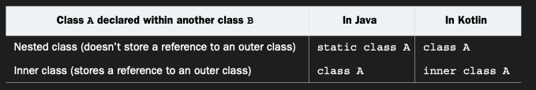
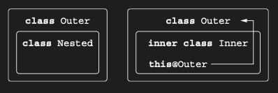

# Inner and nested classes: Nested by default

Bir helper class’ı encapsulate etmek ya da code’u kullanıldığı yere yakın tutmak istiyorsanız, bir class’ı başka bir
class’ın içinde declare edebilirsiniz. Ancak Java’dan farklı olarak, Kotlin’de nested class’lar, siz özellikle talep
etmedikçe outer class instance’ına erişime sahip değildir. Bunun neden önemli olduğunu gösteren bir örneğe bakalım.

```kotlin
interface State : Serializable

interface View {
    fun getCurrentState(): State
    fun restoreState(state: State)
}
```

Button class’ı içinde bir button state’ini kaydeden bir class tanımlamak kullanışlıdır. Bunun Java’da nasıl
yapılabileceğine bakalım.

```java
public class ButtonJava implements View {

    @Override
    public State getCurrentState() {
        return new ButtonState();
    }

    @Override
    public void restoreState(State state) {
    }

    public class ButtonState implements State {
    }
}
```

State interface’ini implement eden ve Button’a özgü bilgileri tutan ButtonState class’ını tanımlarsınız. getCurrentState
method’unda bu class’ın yeni bir instance’ını oluşturursunuz. Gerçek bir case'de, ButtonState’i gerekli tüm data ile
initialize ederdiniz. Bu code’da sorun nedir? Tanımlanan button’ın state’ini serialize etmeye çalıştığınızda neden
java.io.NotSerializableException: Button exception’ı alırsınız? İlk bakışta bu garip görünebilir: serialize ettiğiniz
variable, Button type’ında değil, ButtonState type’ındadır. Java’da bir class’ı başka bir class’ın içinde declare
ettiğinizde, varsayılan olarak inner class hâline geldiğini hatırladığınızda her şey netleşir.

Örnekteki ButtonState class’ı, outer Button class’ına bir referansı implicit olarak saklar. ButtonState’in serialize
edilememesinin nedeni de budur: Button serializable değildir ve ona olan bu referans, ButtonState’in serialization’ını
bozar. Bu problemi düzeltmek için, ButtonState class’ını static olarak declare etmeniz gerekir. Bir nested class’ı
static olarak declare etmek, o class’tan enclosing class’a olan implicit referansı kaldırır. Kotlin’de ise inner
class’ların varsayılan davranışı, az önce tanımladığımızın tersidir; bu durum aşağıda gösterilmiştir.

```kotlin
interface State : Serializable

interface View {
    fun getCurrentState(): State
    fun restoreState(state: State)
}

class Button : View {
    override fun getCurrentState(): State = ButtonState()
    override fun restoreState(state: State) {}

    class ButtonState : State
}
```

Kotlin’de herhangi bir explicit modifier olmadan tanımlanan bir nested class, Java’daki static nested class ile aynıdır.
Onu, outer class’a bir referans içerecek şekilde inner class’a dönüştürmek için inner modifier’ını kullanırsınız.



Yukarıdaki table Java ve Kotlin arasındaki bu davranış farklarını açıklar ve nested ile inner class’lar arasındaki fark,



yukarıda gösterilmiştir. Kotlin’de outer bir class’ın instance’ına referans verme syntax’ı da Java’dan farklıdır. Inner
class içinden Outer class’a erişmek için ```this@Outer``` yazarsınız:

```kotlin
class Outer {
    inner class Inner {
        fun getOuterClassReference() : Outer = this@Outer
    }
}
```

Button örneğini şu şekilde düzeltebiliriz: Anlamlı bir Button state’i tanımlayalım

```kotlin
fun main() {
    val button = Button()
    button.text = "OK"
    button.enabled = false

    val savedState = button.getCurrentState()

    // state bozuluyor
    button.text = "Cancel"
    button.enabled = true

    // geri yükleme
    button.restoreState(savedState)

    println(button.text) // OK
    println(button.enabled) // false
}

interface State : Serializable

interface View {
    fun getCurrentState(): State
    fun restoreState(state: State)
}

class Button : View {
    var text: String = ""
    var enabled: Boolean = true
    override fun getCurrentState(): State = ButtonState(text, enabled)

    override fun restoreState(state: State) {
        // buradaki as Gelen State’i ButtonState olarak daraltır. Çünkü sadece Button kendi state’ini anlayabilir
        val buttonState = state as ButtonState
        text = buttonState.text
        enabled = buttonState.enabled
    }

    // State = o anki durumun kopyası
    class ButtonState(val text: String, val enabled: Boolean) : State
}
```

* State → snapshot

* getCurrentState() → snapshot alır

* restoreState() → snapshot’ı geri uygular
