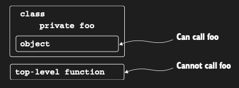

# Companion objects: A place for factory methods and static members

Kotlin’de class’lar static member’lara sahip olamaz. Aslında Kotlin, Java’daki gibi bir static keyword’üne sahip
değildir. Bunun yerine Kotlin, package-level function’lara (birçok durumda static method’ların yerini alabilir) ve
object declaration’lara (diğer durumlarda hem static method’ların hem de static field’ların yerini alır) dayanır. Çoğu
durumda top-level function’ların kullanılması önerilir. Ancak top-level function’lar:



yukarıda gösterildiği gibi, bir class’ın private member’larına erişemez. Private member’lara erişmesi gereken böyle bir
function’a örnek olarak factory method verilebilir. Factory method’lar bir object’in oluşturulmasından sorumludur ve bu
nedenle sıklıkla onun private member’larına erişmeleri gerekir. Bir class instance’ına sahip olmadan call edilebilen
ancak bir class’ın internals’ına erişimi olan bir function yazmak için, onu o class’ın içinde yer alan bir object
declaration’ın member’ı olarak yazabilirsin. Bir class içinde define edilen object declaration’lardan tam olarak biri
özel bir keyword ile işaretlenebilir: companion. Bunu yaptığında, bu object’in method ve property’lerine, object’in
ismini açıkça belirtmeden, doğrudan containing class’ın name’i üzerinden erişme yeteneği kazanırsın. Ortaya çıkan
syntax, Java’daki static method invocation ile tamamen aynıdır. Aşağıda syntax’ı gösteren temel bir örnek vardır:

```kotlin
fun main() {
    MyClass.callMe() // Companion object called

    /* Bir companion object’in kendi class’ına ait olduğunu akılda tutmak önemlidir. Companion object’in member’larına
    class’ın bir instance’ı üzerinden erişemezsin. Bu durum, onları Java’daki static member’lardan da ayırır: */
    val myObject = MyClass()
    // myObject.callMe()
    // Error: Unresolved reference: callMe
}

class MyClass {
    companion object {
        fun callMe() {
            println("Companion object called")
        }
    }
}
```

Companion object, private constructor da dâhil olmak üzere class’ın tüm private member’larına erişime sahiptir.
Bu da onu factory pattern’ı implement etmek için ideal bir aday yapar. İki constructor declare etmeye dair bir örneğe
bakalım ve ardından bunu companion object içinde declare edilen factory method’ları kullanacak şekilde değiştirelim.
SocialUser ve SubscribingUser ile inşa edeceğiz. Daha önce bu entity’ler, ortak interface User’ı implement eden farklı
class’lardı. Şimdi ise yalnızca tek bir class ile yetinmeye, ancak onu oluşturmak için farklı yollar sağlamaya karar
veriyorsun.

```kotlin
class User {
    val nickname: String

    // secondary constructor
    constructor(email: String) {
        nickname = email.substringBefore('@')
    }

    // secondary constructor
    constructor (socialAccountId: Int) {
        nickname = getFromSocialNetwork(socialAccountId)
    }

    fun getFromSocialNetwork(accountId: Int) = "kodee$accountId"
}
```

Aynı mantığı ifade etmenin, birçok nedenden dolayı faydalı olabilen alternatif bir yaklaşımı, class instance’larını
oluşturmak için factory method’lar kullanmaktır. User instance’ı, birden fazla constructor yerine factory method’lar
aracılığıyla oluşturulur.

```kotlin
fun main() {
    createUser()
}

fun createUser() {
    val subscribingUser = User.subscribingUser("egedata@gmail.com")
    println(subscribingUser.nickname) // egedata

    val socialUser = User.socialUser(114)
    println(socialUser.nickname) // kodee114

}

/* Primary constructor’ı private olarak işaretler; bu da onun class body’sinin dışından call edilemeyeceği anlamına
gelir. */
class User private constructor(val nickname: String) {
    companion object {
        fun subscribingUser(email: String) = User(email.substringBefore('@'))

        fun socialUser(accountId: Int) = User(getFromSocialNetwork(accountId))

        fun getFromSocialNetwork(accountId: Int) = "kodee$accountId"
    }
}
```

Factory method’lar oldukça kullanışlıdır. Örnekte gösterildiği gibi, amaçlarına göre adlandırılabilirler. Ayrıca bir
factory method, method’un declare edildiği class’ın subclass’larını da döndürebilir; SubscribingUser ve SocialUser’ın
class olduğu örnekte olduğu gibi. Gereksiz olduğunda yeni object’ler oluşturmayı da engelleyebilirsin. Örneğin, her
email’in benzersiz bir User instance’ına karşılık gelmesini sağlayabilir ve factory method, cache’te zaten bulunan bir
email ile call edildiğinde yeni bir instance yerine mevcut instance’ı döndürebilir. Ancak bu tür class’ları extend etmen
gerekiyorsa, birden fazla constructor kullanmak daha iyi bir çözüm olabilir; çünkü companion object member’ları
subclass’larda override edilemez.

### Extra description

companion object, bir sınıfın (class) içinde tanımlanan ve o sınıfın tüm örnekleri (instance) tarafından paylaşılan özel
bir nesnedir. Java veya C# gibi dillerden geliyorsan, bunu static anahtar kelimesinin Kotlin'deki karşılığı olarak
düşünebilirsin. Normalde bir sınıfın içindeki fonksiyonlara erişmek için o sınıftan bir nesne üretmen gerekir (val
user = User()), ancak companion object içindekilere doğrudan sınıf ismiyle erişebilirsin.

Neden İhtiyaç Duyarız? Normal sınıflar her oluşturulduğunda bellekte yeni bir yer kaplar. Ancak bazen öyle veriler veya
fonksiyonlar vardır ki, bunlar her nesne için ayrı ayrı değil, sınıfın kendisine ait olmalıdır.

* Sabitler (Constants): Sınıfla ilgili değişmez değerleri (örneğin bir veritabanı tablo adı) burada tutarız.

* Factory Methods (Fabrika Metodları): Bir sınıftan nesne üretme mantığını özelleştirmek için kullanılır.

* Paylaşılan Mantık: Sınıfın durumuyla (state) ilgisi olmayan ama o sınıfla mantıksal olarak ilişkili yardımcı
  fonksiyonlar.

Aşağıdaki örnekte idCounter ve MIN_PASSWORD_LENGTH değerleri her kullanıcı için farklı değildir, sınıfın geneline
aittir.

```kotlin
fun main() {
    println("Minimum password length ${User.MIN_PASSWORD_LENGTH}") // Minimum password length 8

    val guest1 = User.createDefaultUser()
    println(guest1.nickname) // Guest 1

    val guest2 = User.createDefaultUser()
    println(guest2.nickname) // Guest 2
}

class User(val nickname: String) {
    // class'ın companion (arkadaş) object'i
    companion object {
        const val MIN_PASSWORD_LENGTH = 8
        private var idCounter = 0

        fun createDefaultUser(): User {
            idCounter++
            return User("Guest $idCounter")
        }
    }
}
```


* İsim vermene gerek yoktur, varsayılan adı Companion olur. Ama istersen companion object Manager { ... } şeklinde isim
  verebilirsin.

* companion objectler de interface'leri implement edebilir. Bu, statik metodlara sahip ama aynı zamanda bir interface
  gibi davranan yapılar kurmanı sağlar.

* companion object içindeki bir fonksiyon, sınıfın private olan constructor'ına (yapıcısına) erişebilir. Bu sayede nesne
  üretimini tamamen kontrol altına alabilirsin (Singleton veya Factory pattern).

Eğer bir değerin veya fonksiyonun, o sınıftan üretilen her nesne için kopyalanmasını istemiyor, sınıfa özel ve tek
kalmasını istiyorsan companion object kullanmalısın.