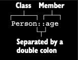

# Member references

Lambda’ların bir code block’unu function’a parameter olarak pass etmene nasıl izin verdiğini gördün, peki ya parameter
olarak pass etmen gereken code zaten bir function olarak defined ise? Elbette, o function’ı call eden bir lambda pass
edebilirsin, fakat bu biraz redundant olur. Function’ı doğrudan pass edebilir misin? Kotlin’de, Java 8’deki gibi,
function’ı bir value’ya dönüştürürsen bunu yapabilirsin. Bunun için :: operator’ünü kullanırsın:

```kotlin
val getAge = Person::age
```

Bu expression member reference olarak adlandırılır ve tam olarak bir method’u call eden veya bir property’ye erişen
function value oluşturmak için kısa bir syntax sağlar. Çift kolon, reference etmen gereken member’ın (method veya
property) adı ile class’ın adını ayırır:



Bu, aynı şeyi yapan bir lambda’nın daha concise (özlü) bir ifadesidir:

```kotlin
val getAge = { person: Person -> person.age }
```

Unutma, ister bir function’a ister bir property’ye reference veriyor ol, member reference’ta adından sonra parantez
koymamalısın. Sonuçta, onu invoke etmiyorsun, sadece ona bir reference ile çalışıyorsun. Bir member reference, o
function veya property’yi call eden bir lambda ile aynı type’a sahiptir, bu yüzden ikisini interchangeably
kullanabilirsin:

```kotlin
people.maxByOrNull(Person::age)
people.maxByOrNull { person: Person -> person.age }
```

2 call'da eşittir. Bir class’ın member’ı olmayan ve top level’da declared edilmiş bir function’a da reference
alabilirsin:

```kotlin
fun main() {
    saySalute() // Salute!
}

fun salute() = println("Salute!")

fun saySalute() {
    // Top-level function’a reference
    run(::salute)
}
```

Bu durumda, class adını atlar ve :: ile başlarsın. Member reference ::salute, corresponding (karşılık gelen) function’ı
call eden library function run’a argument olarak pass edilir. Bir lambda, birden fazla parameter alan bir function’a
delegate ettiğinde, member reference sağlamak özellikle kullanışlıdır—parameter isimlerini ve type’larını tekrar
etmekten kaçınmanı sağlar:

```kotlin
// Bu lambda, sendEmail function’a delegate eder.
val action = { person: Person, message: String ->
    sendEmail(person, message)
}

// Bunun yerine bir member reference kullanabilirsin.
val nextAction = ::sendEmail
```

Bir class’ın instance’ını oluşturma action’ını constructor reference kullanarak store edebilir veya erteleyebilirsin.
Constructor reference, çift kolonlardan sonra class adını belirterek oluşturulur:

```kotlin
data class Person(val name: String, val age: Int)

fun createPerson() {
    /* Person’ın bir instance’ını oluşturma action’ı bir value olarak saved edilir. lambda gibi davranır, ama henüz bir
    Person instance’ı yaratmaz*/
    val createPerson = ::Person
    createPerson("Alice", 23)
}
```

Unutma, extension function’lara da aynı şekilde reference verebilirsin:

```kotlin
fun main() {
    val people = listOf(Person("Derek", 20), Person("Alice", 15))

    val predicate = Person::isAdult
    val filtered = people.filter(predicate)
    println(filtered) // [Person(name=Derek, age=20)]
}

data class Person(val name: String, val age: Int)

fun Person.isAdult() = age >= 18
```

isAdult, Person class’ın bir member’ı olmasa da, reference üzerinden erişebilirsin; tıpkı bir instance üzerinde member
olarak erişebileceğin gibi.