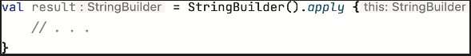

# Initializing and configuring objects: The apply function

apply function, with ile neredeyse tamamen aynı şekilde çalışır; temel fark, apply’nin her zaman kendisine argument
olarak pass edilen object’i (başka bir deyişle, receiver object’i) return etmesidir. Alphabet function’ı bu kez apply
kullanarak tekrar refactor edelim.

```kotlin
fun main() {
    print(alphabet())
    // ABCDEFGHIJKLMNOPQRSTUVWXYZ
}

fun alphabet() = StringBuilder().apply {
    for (letter in 'A'..'Z') {
        append(letter)
    }
}.toString()
```

apply function’ı herhangi bir type üzerinde bir extension function olarak call edebilirsin — bu durumda, yeni
oluşturduğun StringBuilder instance’ı üzerinde call ediyorsun. apply üzerinde call ettiğin object, argument olarak pass
edilen lambda’nın receiver’ı olur:



apply’yi execute etmenin sonucu StringBuilder’dır; bu nedenle sonrasında onu String’e dönüştürmek için toString call
edersin. with function gibi, apply de üzerinde call edildiği object’i lambda içinde receiver type yapar. apply ayrıca
üzerinde call edildiği object’i return eder.

Bunun faydalı olduğu birçok durumdan biri, bir object’in instance’ını oluştururken bazı property’leri hemen
initialize etmen gerektiği durumlardır. Java’da bu genellikle ayrı bir Builder object aracılığıyla gerçekleştirilir;
Kotlin’de ise object’in tanımlı olduğu library’den herhangi bir özel destek gerekmeden, herhangi bir object üzerinde
apply kullanabilirsin. apply’nin bu tür case’lerde nasıl kullanıldığını görmek için, bazı custom attribute’lara sahip
bir Android TextView component’i oluşturan bir example’a bakalım. Bu kod android sdk istemektedir

```kotlin
fun createViewWithCustomAttributes(context: Context) =
    TextView(context).apply {
        text = "Sample Text"
        textSize = 20.0
        setPadding(10, 0, 0, 0)
    }
```

apply function, function için compact expression body style’ı kullanmana olanak tanır. Yeni bir TextView instance’ı
oluşturur ve onu hemen apply’ye pass edersin. apply’ye pass edilen lambda içinde, TextView instance receiver olur;
böylece onun üzerinde method’ları call edebilir ve property’leri set edebilirsin. Lambda execute edildikten sonra,
apply zaten initialize edilmiş olan bu instance’ı return eder; bu da createViewWithCustomAttributes function’ının
sonucu olur. with ve apply function’ları, receiver’lı lambda’ları kullanmanın temel generic örnekleridir. Daha spesifik
function’lar da aynı pattern’i kullanabilir. Örneğin, alphabet function’ı buildString standart library function’ını
kullanarak daha da basitleştirebilirsin; bu function StringBuilder oluşturmayı ve toString call etmeyi halleder.
buildString’in argument’i receiver’lı bir lambda’dır ve receiver her zaman bir StringBuilder’dır.

```kotlin
fun main() {
    print(alphabet())
    // abcdefghijklmnopqrstuvwxyz
}

fun alphabet() = buildString {
    for (letter in 'a'..'z'){
        append(letter)
    }
}
```

buildString function, StringBuilder yardımıyla bir String oluşturma görevine şık bir çözümdür. Kotlin standart
library’si ayrıca collection builder function’larıyla birlikte gelir; bunlar, bir read-only List, Set veya Map
oluşturmanıza yardımcı olurken, construction aşamasında collection’ı mutable olarak işlemenize olanak tanır.

```kotlin
fun buildFunctionExample() {
    val fibonacci = buildList {
        addAll(listOf(1, 1, 2))
        add(3)
        add(index = 0, element = 3)
    }

    println(fibonacci) // [3, 1, 1, 2, 3]

    val shouldAdd = true
    val fruits = buildSet {
        add("apple")
        if (shouldAdd) {
            addAll(
                listOf(
                    "apple",
                    "banana",
                    "cherry"
                )
            )
        }
    }
    println(fruits) // [apple, banana, cherry]

    val medals = buildMap {
        put(1, "Gold")
        putAll(listOf(
            2 to "Silver",
            3 to "Bronze"
        ))
    }
    println(medals) // {1=Gold, 2=Silver, 3=Bronze}
}
```