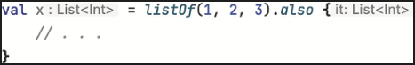

# Performing additional actions with an object: also

apply gibi, also function’ı da bir receiver object almanı, üzerinde bir action gerçekleştirmeni ve ardından receiver
object’i return etmeni sağlar



Temel fark, also lambda’sı içinde receiver object’e bir argument olarak erişmendir — ya ona bir isim vererek, ya da
varsayılan adı it’i kullanarak. Bu, also’yı, orijinal receiver object’i argument olarak alan action’ları çalıştırmak
için uygun hâle getirir (object’in property ve function’ları üzerinde işlem yapan operation’ların aksine). Kodda also
gördüğünde, bunu şu şekilde yorumlayabilirsin:

“… ve ayrıca object ile şunları yap.”

also kullanırken, object lambda içinde receiver type hâline gelmez; bunun yerine object bir argument olarak
kullanılabilir hâle gelir ve varsayılan olarak it adıyla erişilir. also function, call edildiği object’i return eder;
Aşağıdaki example’da, bir fruit collection’ını uppercase isimlerine map ediyorsun ve ayrıca bu mapping’in sonucunu ek
bir collection’a ekliyorsun. Ardından, adı beş karakterden uzun olan meyveleri collection’dan filtreliyorsun ve bu
sonucu da print ediyorsun, sonunda ise listeyi reverse ediyorsun.

```kotlin
fun alsoExample() {
    val fruitList = listOf("apple", "banana", "cherry")
    val upperCase = mutableListOf<String>()
    val reservedList = fruitList
        .map { it.uppercase() }
        .also { upperCase.addAll(it) }
        .filter { it.length > 5 }
        .also { println(it) }
        .reversed()

    println(upperCase)
    println(reservedList)
}
```

Ilk olarak ```.also { println(it) }``` execute edilir;

```
// print edilir
[BANANA, CHERRY] 
```

Daha sonra ```println(upperCase)``` execute edilir;

```
// print edilir
[APPLE, BANANA, CHERRY]
```

En son ```println(reservedList)``` execute edilir;

```
// print edilir
[CHERRY, BANANA]
```

Receiver’lı lambda’lar için daha ilginç example’ları bölüm 13.2’de göreceksin, domain-specific language (DSL)
konusuna başladığımızda. Receiver’lı lambda’lar, DSL oluşturmak için harika araçlardır; bunu nasıl kullanacağını ve
receiver’lı lambda call eden kendi function’larını nasıl define edeceğini göstereceğiz.