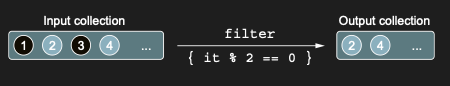
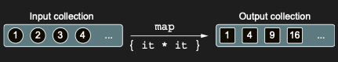

# Removing and transforming elements: filter and map

filter ve map functions, collection’ları manipüle etmenin temelini oluşturur. Birçok collection operations, bunların
yardımıyla ifade edilebilir. Belirli bir predicate’e göre bir collection’ı filtreleme göreviyle karşılaştığınızda ya da
bir collection’ın her bir element’ini farklı bir form’a dönüştürmeniz gerektiğinde, bu functions aklınıza gelmelidir.

Her bir function için, sayılarla bir örnek ve tanıdık Person class’ını kullanan bir örnek sunacağız:

```kotlin
data class Person(val name: String, val age: Int)
```

filter function bir collection boyunca ilerler ve verilen lambda’nın true döndürdüğü element’leri seçer. Örneğin, bize
numbers içeren bir list verildiğinde, filter yalnızca even numbers’ı (2’ye bölmenin remainder’ı 0 olanlar) ayıklamanıza
yardımcı olabilir:

```kotlin
fun main() {
    val list = listOf(1, 2, 3, 4)
    val filteredList = list.filter { it % 2 == 0 }
    println(filteredList) // [2, 4]
}
```

Sonuç, aşağıda gösterildiği gibi, input collection’dan yalnızca predicate’i sağlayan element’leri içeren yeni bir
collection’dır.



Yalnızca 30 yaşından büyük kişilerden oluşan bir collection istiyorsanız, filter’ı tekrar kullanabilirsiniz:

```kotlin
fun main() {
    val people = listOf(
        Person("Alice", 29),
        Person("Derek", 31),
        Person("Ocean", 16),
        Person("Jim", 41),
    )
    val olderPeople = people.filter { it.age > 30 }
    println(olderPeople) // [Person(name=Derek, age=31), Person(name=Jim, age=41)]
}

data class Person(val name: String, val age: Int)
```

filter function, verilen bir predicate ile eşleşen element’lerden oluşan yeni bir collection oluşturabilir, ancak bu
süreçte element’leri dönüştürmez (transform) — çıktı hâlâ Person object’lerinden oluşan bir collection’dır. Bunu,
type’larını değiştirmeden collection’ınızdan girdileri “extract” etmek olarak düşünebilirsiniz.

Bunu, input collection’ınızdaki element’leri dönüştürmenize olanak tanıyan map function ile karşılaştırın. Verilen
function’ı collection’daki her bir element’e uygular ve return edilen value’ları yeni bir collection içinde toplar.
Aşağıdaki örnekte olduğu gibi, numbers içeren bir list’i onların square’larından oluşan bir list’e dönüştürmek için
kullanılabilir:

```kotlin
fun main() {
    val list = listOf(1, 2, 3, 4)
    val transformed = list.map { it * it }
    println(transformed) // [1, 4, 9, 16]
}
```

Sonuç, aşağıdaki resimde görüldüğü gibi, aynı sayıda element içeren yeni bir collection’dır; ancak her bir element,
verilen predicate function’a göre dönüştürülmüştür. map function, bir collection’daki tüm element’lere bir lambda
uygular.



Yalnızca kişilerin bir list’ini değil de sadece isimlerin bir list’ini yazdırmak istiyorsanız, list’i map kullanarak
dönüştürebilirsiniz. Bu, Person object’lerinden oluşan list’i, onların isimlerini represent eden String object’lerinden
oluşan bir list’e dönüştürür ve bunu kolayca yazdırabilirsiniz:

```kotlin
fun main() {
    val people = listOf(
        Person("Alice", 22),
        Person("Derek", 31),
        Person("Jim", 19),
    )

    val transformedList = people
        .map { it.name }

    println(transformedList) // [Alice, Derek, Jim]
}
```

Bu örneğin member references kullanılarak oldukça hoş bir şekilde yeniden yazılabileceğini unutmayın:

```kotlin
val transformedList = people.map(Person::name)
```

Bunun gibi birden fazla call’ı kolayca chain edebilirsiniz. Örneğin, 30 yaşından büyük kişilerin isimlerini bulalım:

```kotlin
fun main() {
    val people = listOf(
        Person("Alice", 22),
        Person("Derek", 31),
        Person("Jim", 19),
    )

    val olderPeopleName = people
        .filter { it.age > 30 }
        .map(Person::name)

    println(olderPeopleName) // [Derek]
}
```

Şimdi de diyelim ki gruptaki en yaşlı kişileri bulmanız gerekiyor. Gruptaki kişilerin maximum yaşını bulabilir ve bu
yaşta olan herkesi döndürebilirsiniz (ya da böyle bir kişi yoksa null — nullability hakkında daha fazlası chapter 7’de).
Lambda’lar kullanarak böyle bir kod yazmak kolaydır:

```kotlin
fun main() {
    val people = listOf(
        Person("Alice", 22),
        Person("Derek", 31),
        Person("Jim", 19),
    )

    val filtered = people.filter {
        val oldestPerson = people.maxByOrNull(Person::age)
        it.age == oldestPerson?.age
    }
    println(filtered) // [Person(name=Derek, age=31)]
}
```

Buradaki ```it.age == oldestPerson?.age``` satırı, listenin içindeki her bir kişinin yaşını, bulduğumuz "en yaşlı
kişinin yaşı" ile kıyaslayan bir mantıksal sorgudur. filter fonksiyonu listenin içindeki her elemanı tek tek gezer.
Süslü parantez { } içindeki kodun sonucu true dönerse o kişiyi yeni listeye ekler, false dönerse eler. it, o anda
kontrol edilen mevcut kişiyi temsil eder.

* it.age: "Şu an kontrol ettiğim kişinin yaşı kaç?"

* ==: "Eşit mi?"

* oldestPerson?.age: "Listenin en başında bulduğum en büyük yaş değeri kaç?" (Buradaki ?, eğer liste boşsa ve
  oldestPerson null ise uygulamanın çökmesini engeller).

Ancak bu kodun, her kişi için maximum yaşı bulma sürecini tekrar ettiğini unutmayın; yani collection’da 100 kişi varsa,
maximum yaş araması 100 kez yapılacaktır! Aşağıdaki çözüm bunu iyileştirir ve maximum yaşı yalnızca bir kez hesaplar:

```kotlin
fun main() {
    val people = listOf(
        Person("Alice", 22),
        Person("Derek", 31),
        Person("Jim", 19),
    )

    val maxAge = people.maxByOrNull(Person::age)?.age
    val filtered = people.filter { it.age == maxAge }
    println(filtered) // [Person(name=Derek, age=31)]

}
```

Buradaki ```?.age``` "Eğer sol taraf (en yaşlı kişi) null değilse yaşını (age) getir; ama eğer null ise işlemi orada kes
ve bana doğrudan null döndür."

Gerekmiyorsa bir calculation'ı tekrar etmeyin! Lambda expression’lar kullanılarak yazılmış basit görünen kod, bazen
underlying operation’ların karmaşıklığını gizleyebilir. Yazdığınız kodda neler olduğunu her zaman aklınızda bulundurun.

Eğer filtering ve transformation operation’larınız, element’lerin actual value’larının yanı sıra index’lerine de
bağlıysa, lambda’nıza element’in kendisiyle birlikte (zero-based) index’i de sağlayan sibling function’lar olan
filterIndexed ve mapIndexed’i kullanabilirsiniz. Bu örnekte, numbers içeren bir list’i yalnızca even index’te olan ve
3’ten büyük değerleri içerecek şekilde filtreliyorsunuz. Ayrıca ikinci bir list’i, her element’in index numarası ile
sayısal value’sunu toplayacak şekilde map ediyorsunuz:

```kotlin
fun main() {
    val numbers = listOf(1, 2, 3, 4, 5, 6, 7)

    val filtered = numbers
        .filterIndexed { index, element ->
            index % 2 == 0 && element > 3
        }
    println(filtered) // [5, 7]

    val mapped = numbers
        .mapIndexed { index, element ->
            index + element
        }
    println(mapped) // [1, 3, 5, 7, 9, 11, 13]
}
```

Filter ve transformation function’lar, map’ler üzerinde de uygulanabilir:

```kotlin
fun main() {
    val numbers = mapOf(
        0 to "Zero",
        1 to "One",
        2 to "Two"
    )

    val mapped = numbers
        .mapValues { it.value.uppercase() }
    println(mapped) // {0=ZERO, 1=ONE, 2=TWO}
}
```

Key’leri ve value’ları işlemek için ayrı function’lar vardır. filterKeys ve mapKeys, sırasıyla bir map’in key’lerini
filtreler ve dönüştürür; filterValues ve mapValues ise karşılık gelen value’ları filtreler ve dönüştürür.

* filterKeys - mapKeys;

```kotlin
fun main() {
    val numbers = mapOf(
        0 to "Zero",
        1 to "One",
        2 to "Two"
    )

    val filterKeys = numbers
        .filterKeys { it > 1 }
    println(filterKeys) // {2=Two}

    val mapKey = numbers
        .mapKeys { "ID: ${it.key}"}
    println(mapKey) // {ID: 0=Zero, ID: 1=One, ID: 2=Two}
}
```

* filterValues - mapValues

```kotlin
fun main() {
    val numbers = mapOf(
        0 to "Zero",
        1 to "One",
        2 to "Two"
    )

    val mapped = numbers
        .mapValues { it.value.uppercase() }
        .filterValues { it.length > 3 }
    println(mapped) // {0=ZERO}
}
```