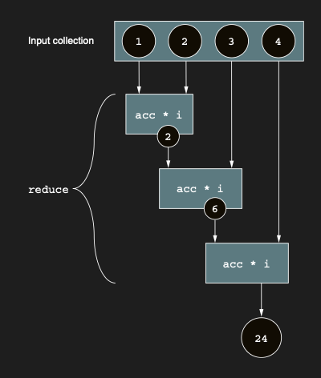
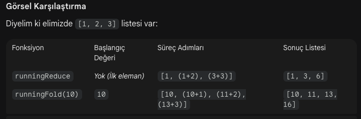

# Accumulating values for collections: reduce and fold

filter ve map function’larına ek olarak, reduce ve fold, functional style’da collection’larla çalışırken iki temel yapı
taşıdır. Bu function’lar, bir collection’dan bilgi aggregate etmek için kullanılır: bir collection verildiğinde, tek bir
value döndürürler. Bu value, bir “accumulator” içinde kademeli olarak oluşturulur. Lambda’nız, her element için çağrılır
ve yeni bir accumulator value döndürmelidir.

reduce kullanırken, accumulator olarak collection’ınızın ilk element’i ile başlarsınız (bu yüzden boş bir collection’da
çağırmayın!). Lambda’nız daha sonra accumulator ve ikinci element ile çağrılır. Bu örnekte, reduce’u input collection’ın
value’larını sırasıyla toplamak ve çarpmak için kullanıyorsunuz:

reduce function, accumulator’ında bir sonucu kademeli olarak oluşturur; her element ve önceki accumulator value ile
lambda’nızı tekrar tekrar invoke eder.



```kotlin
fun main() {
    val list = listOf(1, 2, 3, 4)
    val summed = list.reduce { accumulator, element ->
        accumulator + element
    }
    println(summed) // 10

    val multiplied = list.reduce { accumulator, element ->
        accumulator * element
    }
    println(multiplied) // 24
}
```

reduce'a ait bir örneğe daha bakalım:

```kotlin
fun main() {
    val people = listOf(
        Person("Alex", 29),
        Person("Natalia", 30),
        Person("Derek", 31),
    )

    val oldest = people
        .filter { it.age > 29 }
        .reduce { acc, person ->
            if (person.age > acc.age) person else acc
        }
    println(oldest) // Person(name=Derek, age=31)

    val combined = people
        .filter { it.age > 29 }
        .reduce { accumulator, person ->
            println("Oldest")
            Person(accumulator.name + "&" + person.name, accumulator.age + person.age)
        }
    println(combined) // Person(name=Natalia&Derek, age=61)
    println(combined.name) // Natalia&Derek
}

data class Person(val name: String, val age: Int)


```

reduce fonksiyonu, bir koleksiyondaki elemanları tek bir değere indirmek (birleştirmek) için kullanılır. Yukarıda ki
örnekte filter işleminden sonra elinde sadece yaşlı olan kişiler kalıyor ve reduce ile bu kişileri bir şekilde
birleştirmen bekleniyor. Ancak burada kritik bir kural var: reduce fonksiyonunda sonuç tipi, koleksiyonun tipiyle aynı
olmalıdır. Yani Person listesini reduce ediyorsan, sonuç yine bir Person nesnesi olmalıdır.

fold function, kavramsal olarak reduce’a çok benzer; ancak collection’ınızın ilk element’ini başlangıçta accumulator’a
koymak yerine, arbitrary bir başlangıç value’su seçebilirsiniz. Bu örnekte, fold kullanarak iki Person object’inin name
field’ını concatenate ediyorsunuz (bu iş genellikle daha önce incelediğimiz joinToString function için uygundur, ancak
yine de açıklayıcı bir örnektir). Accumulator’ı empty bir string ile initialize ediyorsunuz ve ardından lambda’nız
içinde final text’i kademeli olarak oluşturuyorsunuz:

fold function, accumulator’ın initial value’sunu ve type’ını belirtmenize olanak tanır. Sonuç, accumulator–element
çiftlerinin her biri üzerinde lambda’nız tekrar tekrar uygulanarak accumulator içinde kademeli olarak oluşturulur.


```kotlin
fun main() {
    val people = listOf(
        Person("Alex", 29),
        Person("Natalia", 30),
    )

    val folded = people.fold("") { accumulator, person ->
        accumulator + person.name
    }
    println(folded) // AlexNatalia
}

data class Person(val name: String, val age: Int)
```

Eğer amacın kişileri toplayıp toplam yaşı (Int) veya bir String elde etmekse (yani tipi değiştirmek istiyorsan), reduce
yerine fold kullanmalısın. Çünkü reduce her zaman listenin tipi neyse (Person) onu döndürmek zorundadır.

```kotlin
fun main() {
    val people = listOf(
        Person("Alex", 29),
        Person("Natalia", 30),
        Person("Derek", 31),
    )

    val summedAges = people
        .filter { it.age > 29 }
        .fold(0) { sum, person ->
            sum + person.age
        }
    println(summedAges) // 61
}

data class Person(val name: String, val age: Int)
```

fold veya reduce operation kullanarak özlü bir şekilde ifade edebileceğiniz birçok algoritma vardır. reduce veya fold
operation’larının tüm intermittent (aralıklı) value’larını elde etmek istediğiniz durumlarda, runningReduce ve
runningFold function’ları imdadınıza yetişir. Daha önce ele aldığımız reduce ve fold function’larına kıyasla tek
farkları, bu function’ların bir list döndürmesidir. Bu list, final result ile birlikte tüm intermittent (aralıklı)
accumulator value’larını içerir. Bu örnekte, önceki paragraflarda tartışılan snippet’lerin running karşılığını
kullanıyorsunuz:

runningReduce;

```kotlin
fun main() {
    val list = listOf(1, 2, 3, 4)
    val summed = list.runningReduce { acc, elm ->
        acc + elm
    }
    // Final result aynı olsa da, running function’lar tüm intermediate value’ları da döndürür.
    println(summed) // [1, 3, 6, 10]

    val multiplied = list.runningReduce { acc, elm ->
        acc * elm
    }
    // Final result aynı olsa da, running function’lar tüm intermediate value’ları da döndürür.
    println(multiplied) // [1, 2, 6, 24]
}
```

runningFold;

```kotlin
fun main() {
    val people = listOf(
        Person("Alex", 29),
        Person("Bob", 19),
    )

    val runningFold = people.runningFold("#") { acc, person ->
        acc + person.name
    }
    println(runningFold) // [#, #Alex, #AlexBob]
}

data class Person(val name: String, val age: Int)
```

### Extra description

runningReduce, reduce fonksiyonuyla aynı mantıkla çalışır ancak çok önemli bir farkı vardır: Ara adımların tamamını bir
liste olarak size geri verir. reduce sadece final sonucunu (tek bir değer) döndürürken, runningReduce her bir eleman
eklendiğinde sonucun nasıl değiştiğini ("yürüyen toplam" gibi) takip etmenizi sağlar.

Elimizde bir Person listesi olsun. Bu kişilerin yaşlarını adım adım toplayarak birikimli bir liste oluşturmak isteyelim:

```kotlin
fun main() {
    val people = listOf(
        Person("Alex", 29),
        Person("Natalia", 30),
        Person("Derek", 31),
    )

    // Yaşları adım adım toplayan bir süreç
    val ageEvolution = people.runningReduce { acc, person ->
        // acc burada bir önceki adımda oluşturulan Person nesnesidir
        Person("Total", acc.age + person.age)
    }

    ageEvolution.forEach { println(it) }
    // Person(name=Alex, age=29)
    // Person(name=Total, age=59)
    // Person(name=Total, age=90)
}

data class Person(val name: String, val age: Int)
```


Bunu en iyi "Bakiye Takibi" örneğinde anlarız. Diyelim ki bir gün içindeki harcamaların var ve her harcamadan sonra
bakiyenin ne olduğunu görmek istiyorsun:

```kotlin
fun main() {
    val expenses = listOf(100, 50, 200, 30)
    val balanceHistory = expenses.runningReduce { acc, exp ->
        acc + exp
    }
    println(balanceHistory) // [100, 150, 350, 380]
}
```

Eğer sadece "Toplam sonuç nedir?" diyorsan: reduce.

Eğer "Sonuca gidene kadar hangi aşamalardan geçildi?" veya "Adım adım kümülatif toplam nedir?" diyorsan: runningReduce.

runningFold, tıpkı runningReduce gibi çalışır ancak çok önemli bir avantajı vardır: Başlangıç değerini (seed value) siz
belirlersiniz. runningReduce ilk elemanı otomatik olarak başlangıç değeri kabul ederken, runningFold size "sıfırıncı"
adımı belirleme şansı verir. Bu sayede listenin tipinden farklı bir tipte sonuçlar da üretebilirsiniz.

runningFold Nasıl Çalışır? Şu üç şeyi bilmeniz yeterlidir:

* Initial Value: İşlemin başlayacağı ilk değer.

* Accumulator (acc): O ana kadar birikmiş toplam.

* Element: Listeden gelen sıradaki eleman.

Elimizde Person listesi olsun ama biz sadece yaşların toplamının nasıl ilerlediğini bir Int listesi olarak görmek
isteyelim:

```kotlin
fun main() {
    val people = listOf(
        Person("Alex", 29),
        Person("Natalia", 30),
        Person("Derek", 31)
    )

    val ageEvolution = people.runningFold(0) { acc, person ->
        acc + person.age
    }
    println(ageEvolution) // [0, 29, 59, 90]
}

data class Person(val name: String, val age: Int)
```

Neden runningReduce yerine runningFold tercih edilir?

* Tip Değişimi: Listen Person nesnelerinden oluşsa bile, sen sonuç listesini Int, String veya bambaşka bir nesne tipi
  yapabilirsin.

* Boş Liste Güvenliği: runningReduce boş bir listede hata verirken (çünkü ilk elemanı bulamaz), runningFold hata vermez;
  doğrudan senin verdiğin başlangıç değerini içeren tek elemanlı bir liste döndürür.

* Başlangıç Kontrolü: Toplamaya 0 yerine 100 ile başlaman gerekiyorsa bunu sadece fold ile yapabilirsin.



```kotlin
fun main() {
    val words = listOf("Kotlin", "öğrenmek", "keyiflidir")

    val sentenceProgress = words.runningFold("Cümle") { acc, word ->
        "$acc $word"
    }
    println(sentenceProgress)
    // [Cümle, Cümle Kotlin, Cümle Kotlin öğrenmek, Cümle Kotlin öğrenmek keyiflidir]
}
```