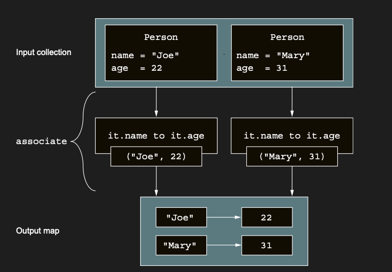

# Transforming collections into maps: associate, associateWith, and associateBy

groupBy ile, element’leri ortak bir özelliğe göre gruplayarak bir list’ten associative (ilişkisel) bir data structure
oluşturmanın bir yolunu zaten biliyorsunuz. Element’leri gruplamadan bir collection’ın element’lerinden bir map
oluşturmak istiyorsanız, associate function devreye girer. Input collection’daki bir item’dan bir key–value pair’e
dönüşümü ifade eden bir lambda sağlarsınız ve bu pair map’e yerleştirilir.

Bu örnekte, associate function’ı Person object’lerinden oluşan bir list’i, isimlerden yaşlara giden bir map’e
dönüştürmek ve herhangi bir Map<String, Int> ile yaptığınız gibi örnek bir value’yu sorgulamak için kullanırsınız. Bölüm
3.4.3’te tanıttığımız infix function to’yu, tek tek key–value pair’leri belirtmek için kullanırsınız:

associate function, lambda’nız tarafından döndürülen key ve value pair’lerine dayanarak bir list’i bir map’e dönüştürür.



```kotlin
fun main() {
    val people = listOf(
        Person("Joe", 22),
        Person("Mary", 31)
    )

    // infix function to, sol ve sağ operand’ından bir Pair oluşturur.
    val nameToAge = people.associate { it.name to it.age }
    println(nameToAge) // {Joe=22, Mary=31}
    println(nameToAge["Mary"]) // 31
}

data class Person(val name: String, val age: Int)
```

Custom key’ler ve custom value’lar içeren pair’ler oluşturmak yerine, collection’ınızdaki element’ler ile başka belirli
bir value arasında bir association oluşturmak isteyebilirsiniz. Bunu associateWith ve associateBy function’ları ile
yapabilirsiniz.

associateWith, collection’ınızdaki orijinal element’leri key olarak kullanır. Sağladığınız lambda, her bir key için
karşılık gelen value’yu üretir.

Öte yandan, associateBy collection’ınızdaki orijinal element’leri value olarak kullanır ve map’in key’lerini üretmek
için lambda’nızı kullanır.

Bu örnekte, önce associateWith function’ını kullanarak kişilerden yaşlara giden bir map oluşturuyorsunuz. Ardından
associateBy function’ını kullanarak, yaşlardan kişilere giden ters map’i oluşturuyorsunuz:

```kotlin
fun main() {
    val people = listOf(
        Person("Joe", 22),
        Person("Mary", 31),
        Person("Jamie", 22)
    )

    val personToAge = people.associateWith { it.age }
    println(personToAge)
    // Joe ve Jamie aynı yaştalar
    // {Person(name=Joe, age=22)=22, Person(name=Mary, age=31)=31, Person(name=Jamie, age=22)=22}

    // key olarak kullanılmaktadır …
    val ageToPerson = people.associateBy { it.age }
    println(ageToPerson)
    // dolayısıyla map’te yalnızca ikincisi görünür.
    // {22=Person(name=Jamie, age=22), 31=Person(name=Mary, age=31)}
}
```

Map’ler için key’lerin unique olması gerektiğini aklınızda bulundurun; associate, associateBy ve associateWith
tarafından üretilenler de bu konuda istisna değildir. Transformation function’ınız aynı key’in birden fazla kez
eklenmesine yol açarsa, son sonuç önceki tüm assignment’ların üzerine yazar.