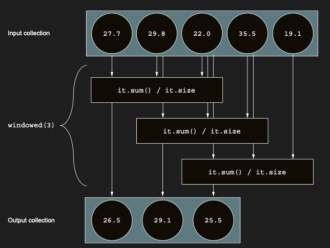

# Splitting collections: chunked and windowed

Collection’ınızdaki data bir bilgi serisini represent ettiğinde, aynı anda birden fazla ardışık value ile çalışmak
isteyebilirsiniz. Örneğin, bir sıcaklık sensörünün günlük ölçümlerinden oluşan bir list’i ele alın:

```kotlin
val temperatures = listOf(27.7, 29.8, 22.0, 35.5, 19.1)
```

Bu value’lar list’inde her gün set’i için üç günlük bir average elde etmek için, size’ı 3 olan bir sliding window
kullanırsınız; önce ilk üç value’nun average’ını alırsınız: 27.7, 29.8 ve 22.0. Ardından window’u bir index ileri
“kaydırır”, 29.8, 22.0 ve 35.5’in average’ını alırsınız. Son üç value’ya — 22.0, 35.5 ve 19.1 — ulaşana kadar kaydırmaya
devam edersiniz.

Bu tür sliding window’ları üretmek için windowed function’ı kullanabilirsiniz. windowed, çıktıyı dönüştüren bir
lambda’yı opsiyonel olarak geçirmenize izin verir. Sıcaklık ölçümleri case’inde bu, her window’un average’ını hesaplamak
olabilir.

windowed function, input collection’ınızı bir sliding window kullanarak işler:



```kotlin
fun main() {
    val temperatures = listOf(27.7, 29.8, 22.0, 35.5, 19.1)
    println(temperatures.windowed(3))
    // [[27.7, 29.8, 22.0], [29.8, 22.0, 35.5], [22.0, 35.5, 19.1]]

    val calculation = temperatures.windowed(3) { it.sum() / it.size }
    println(calculation) // [26.5, 29.099999999999998, 25.53333333333333]
}
```

Input collection’ınız üzerinde bir sliding window çalıştırmak yerine, collection’ı verilen bir size’a sahip ayrı
parçalara bölmek isteyebilirsiniz. chunked function bunu gerçekleştirmenize yardımcı olur. Bir kez daha, çıktıyı
dönüştüren bir lambda’yı da geçebilirsiniz:

chunked function, input collection’ınızı belirtilen size’daki çakışmayan segment’ler halinde işler.


```kotlin
fun main() {
    val temperatures = listOf(27.7, 29.8, 22.0, 35.5, 19.1)
    val chunked = temperatures.chunked(2)
    println(chunked) // [[27.7, 29.8], [22.0, 35.5], [19.1]]

    val summed = temperatures.chunked(2) { it.sum() }
    println(summed) // [57.5, 57.5, 19.1]
}
```

Önceki örnekte, 2’lik bir chunk size belirtmiş olmanıza rağmen, üretilen son chunk daha küçük bir size’a sahip olabilir:
input collection tek sayıda item içerdiği için, chunked function size’ı 2 olan iki chunk oluşturur ve kalan item’ı
üçüncü bir chunk’a koyar.