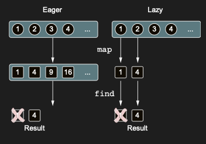
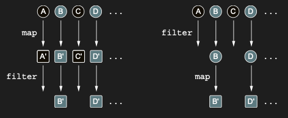

# Executing sequence operations: Intermediate and terminal operations

Sequence üzerindeki operation’lar iki kategoriye ayrılır: intermediate ve terminal. Bir intermediate operation, original
sequence’in element’lerini nasıl dönüştüreceğini bilen başka bir sequence döndürür. Bir terminal operation ise bir sonuç
döndürür; bu sonuç bir collection, bir element, bir number ya da initial collection üzerindeki transformation sequence’i
sonucunda elde edilen herhangi başka bir object olabilir:


Intermediate operation’lar her zaman lazy’dir. Terminal operation’ın eksik olduğu bu örneğe bakın:

```kotlin
fun main() {
    val list = listOf(1, 2, 3, 4)
        .asSequence()
        .map {
            print("map($it) ")
            it * it
        }.filter {
            print("filter($it) ")
            it % 2 == 0
        }
    println(list) // kotlin.sequences.FilteringSequence@4f023edb
}
```

Bu kod snippet’ini execute etmek, beklenen sonucu konsola yazdırmaz — bu operation’ların sonucunu görmek yerine yalnızca
Sequence object’inin kendisini görürsünüz. map ve filter transformation’larının execute edilmesi ertelenir ve yalnızca
sonuç elde edildiğinde (yani bir terminal operation çağrıldığında) uygulanırlar:

```kotlin
fun main() {
    val list = listOf(1, 2, 3, 4)
        .asSequence()
        .map {
            print("map($it) ")
            it * it
        }.filter {
            print("filter($it) ")
            it % 2 == 0
        }.toList()
    println(list)
    // map(1) filter(1) map(2) filter(4) map(3) filter(9) map(4) filter(16) [4, 16]
}
```

Terminal operation (toList), postponed (ertelenmiş) tüm computation'ların gerçekleştirilmesine neden olur. Bu örnekte
fark edilmesi gereken bir diğer önemli nokta, computation'ların hangi sırayla gerçekleştirildiğidir. Naif yaklaşım, önce
her element üzerinde map function’ı çağırmak, ardından ortaya çıkan sequence’in her element’i üzerinde filter function’ı
çağırmak olurdu. Collection’lar üzerinde map ve filter bu şekilde çalışır; ancak sequence’ler için durum böyle değildir.
Sequence’lerde, tüm operation’lar her bir element’e sırasıyla uygulanır: önce ilk element process edilir (mapped,
ardından filtered), sonra ikinci element process edilir ve bu şekilde devam eder.

Bu yaklaşım, sonuç element’lere ulaşılmadan önce elde edilirse bazı element’lerin hiç transfor edilmemesi anlamına
gelir. map ve find operation’larıyla bir örneğe bakalım. Önce bir number’ı onun square’ına map edersiniz, ardından 3’ten
büyük olan ilk item’ı find edersiniz:

```kotlin
fun main() {
    val find = listOf(1, 2, 3, 4)
        .asSequence()
        .map { it * it }
        .find { it > 3 }

    println(find) // 4
}
```

Aynı operation’lar bir sequence yerine bir collection’a uygulandığında, map’in result'u önce evaluate edilir ve initial
collection’daki tüm element’ler transform edilir. İkinci adımda ise, intermediate collection içinde predicate’i sağlayan
bir element bulunur. Sequence’lerde ise lazy yaklaşım, bazı element’lerin processing’inin atlanabilmesi anlamına gelir.
Şekil 6.12, bu kodun eager (collection’lar kullanılarak) ve lazy (sequence’ler kullanılarak) şekilde evaluate edilmesi
arasındaki farkı gösterir.

Eager evaluation, her bir operation’ı tüm collection üzerinde çalıştırır; lazy evaluation ise element’leri tek tek
process eder.



İlk durumda, collection’larla çalıştığınızda, list başka bir list’e dönüştürülür; dolayısıyla map transformation’ı 3 ve
4 dâhil olmak üzere her bir element’e uygulanır. Sonrasında, predicate’i sağlayan ilk element bulunur: 2’nin karesi.

İkinci durumda, find call’u element’leri birer birer işlemeye başlar. Orijinal sequence’ten bir number alırsınız, onu
map ile transform edersiniz ve ardından find’e verilen predicate ile eşleşip eşleşmediğini kontrol edersiniz. 2’ye
ulaştığınızda, karesinin 3’ten büyük olduğunu görürsünüz ve bunu find operation’ının sonucu olarak döndürürsünüz. Sonuç
3 ve 4’e ulaşmadan bulunduğu için, onları incelemeniz gerekmez.

Bir collection üzerinde gerçekleştirdiğiniz operation’ların sırası da performance’ı etkileyebilir. Diyelim ki bir people
collection’ınız var ve name’lerini, belirli bir limit’ten kısa olmaları durumunda yazdırmak istiyorsunuz. İki şey
yapmanız gerekir: her person’ı name’ine map etmek ve ardından çok uzun olan name’leri filter etmek. Bu durumda map ve
filter operation’larını herhangi bir sırayla uygulayabilirsiniz. Her iki yaklaşım da aynı sonucu verir, ancak
gerçekleştirilmesi gereken toplam transformation sayısı açısından farklılık gösterir:

Önce **filter** uygulamak, gerçekleştirilen toplam **transformation** sayısını azaltmaya yardımcı olur.



```kotlin
fun main() {
    val people = listOf(
        Person("Alice", 29),
        Person("Bob", 31),
        Person("Charles", 31),
        Person("Dan", 21)
    )

    val firstMap = people
        .asSequence()
        .map(Person::name)
        .filter { it.length < 4 }
        .toList()

    val filterFirst = people
        .asSequence()
        .filter { it.name.length < 4 }
        .map(Person::name)
        .toList()

    println(firstMap) // [Bob, Dan]
    println(filterFirst) // [Bob, Dan]
}

data class Person(val name: String, val age: Int)
```

Eğer **map** önce gelirse, bir sonraki adımda elenecek ve bir daha hiç kullanılmayacak olsa bile her **element**
dönüştürülür. **filter**’ı önce uygularsanız, uygun olmayan element’ler mümkün olan en erken aşamada elenir ve
dönüştürülmez. Genel bir kural olarak, operation zincirinizden element’leri ne kadar erken çıkarabilirseniz (tabii ki
kodunuzun mantığını bozmadan), kodunuz o kadar **performant** olur.