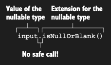

# Extending types without the safe-call operator: Extensions for nullable types

Nullable type’lar için extension function tanımlamak, null value’larla başa çıkmanın bir diğer güçlü yoludur. Bir method
call’dan önce bir variable’ın null olamayacağından emin olmak yerine, receiver olarak null ile çağrılmasına izin
verebilir ve null ile function içinde ilgilenebilirsin. Bu yalnızca extension function’lar için mümkündür; normal member
call’lar object instance üzerinden dispatch edilir ve bu nedenle instance null olduğunda hiç yapılamaz.

```kotlin
fun verifyUserInput(input: String?) {
    // Safe call gerekmez.
    if (input.isNullOrBlank()) println("Required field")
}

fun main() {
    verifyUserInput(" ") // Required field
    // isNullOrBlank’i receiver olarak null ile call ettiğinde hiçbir exception oluşmaz.
    verifyUserInput(null) // Required field
}
```

Nullable receiver için declare edilmiş bir extension function’ı safe access kullanmadan call edebilirsin. Function,
olası null values’ları handle eder.

Nullable type’lar için extension’lar, receiver’ları için null case’i kendileri handle etmeyi bilir. Bu nedenle safe call
olmadan access edilebilirler.



isNullOrBlank function’ı null için açıkça check yapar ve bu durumda true döner; ardından yalnızca non-nullable bir
String üzerinde çağrılabilen isBlank’i call eder.

```kotlin
fun String?.isNullOrBlank(): Boolean =
    this == null || this.isBlank()
```

Nullable bir type (sonunda `?` olan) için bir extension function declare ettiğinde, bu function’ı nullable value’lar
üzerinde call edebilirsin; function body içinde `this` null olabilir, bu yüzden bunu açıkça check etmen gerekir. Java’da
`this` her zaman non-null’dır çünkü içinde bulunduğun class’ın instance’ına referans eder. Kotlin’de ise durum böyle
değildir: nullable bir type için yazılmış bir extension function’da `this` null olabilir.

Daha önce bahsettiğimiz **let** function’ının nullable bir receiver üzerinde de call edilebildiğini unutma; ancak **let
**, value’nun null olup olmadığını **kontrol etmez**. Nullable bir type üzerinde **safe-call operator (`?.`) kullanmadan
** let’i çağırırsan, lambda parametresi de **nullable** olur. Bu da şu anlama gelir: value null olsa bile, **lambda her
durumda execute edilir**.

```kotlin
fun sendEmailTo(email: String) {
    println("Sending email to : $email")
}

fun main() {
    val recipient: String? = null

    // Safe call yok, bu yüzden **nullable type**’a sahiptir.
    // recipient.let { sendEmailTo(it) }
    // ERROR: Type mismatch:
    // inferred type is String? but String was expected
}
```

Bu nedenle, **let** ile argümanların non-null olup olmadığını kontrol etmek istiyorsan, daha önce gördüğün gibi
safe-call operator `?.` kullanman gerekir: `recipient?.let { sendEmailTo(it) }`.

Kendi extension function’larını tanımlarken, bunları nullable type için mi tanımlaman gerektiğini düşünmelisin.
Varsayılan olarak, non-nullable type için bir extension olarak tanımla. Daha sonra, çoğunlukla nullable value’lar
üzerinde kullanıldığı ve null value’nun makul bir şekilde handle edilebildiği ortaya çıkarsa, bunu güvenle
değiştirebilirsin (hiçbir code bozulmaz).

Bu bölümde beklenmedik bir şey gördün. Bir variable’ı ekstra bir check olmadan dereference ettiğinde, örneğin
`s.isNullOrBlank()` şeklinde, bu durum variable’ın non-null olduğu anlamına gelmez—function, nullable type için
tanımlanmış bir extension olabilir. Şimdi, seni şaşırtabilecek başka bir durumu ele alalım: bir type parameter, sonunda
question mark olmasa bile nullable olabilir.