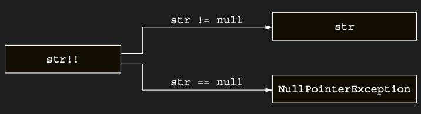

# Making promises to the compiler with the non-null assertion operator: !!

Non-null assertion, Kotlin’in nullable type’a sahip bir value ile başa çıkmak için sunduğu en basit ve en keskin
araçtır. Çift ünlem işaretiyle temsil edilir ve herhangi bir value’yu non-nullable bir type’a dönüştürür. Null value’lar
için bir exception fırlatılır:

Non-null assertion kullanarak, value’nun null olma durumunu açıkça ele almak zorunda kalmazsın. Bunun yerine, null bir
value ile karşılaşıldığında bir exception fırlatılır.



İşte nullable bir argument’ı non-null bir argument’a dönüştürmek için assertion kullanan basit bir function örneği.

```kotlin
fun ignoreNulls(str: String?) {
    val strNotNull: String = str!!
    println(strNotNull.length)
}

fun main() {
    ignoreNulls("Adc") // 3

    ignoreNulls(null)
    // Exception in thread "main" java.lang.NullPointerException
}
```

Bu function’da str null ise ne olur? Kotlin’in fazla seçeneği yoktur: runtime’da bir exception fırlatır. Ancak dikkat
et, exception’ın fırlatıldığı yer value’yu kullanmaya çalıştığın sonraki bir satır değil, assertion’ın kendisidir.
Özünde compiler’a şunu söylersin: “Value’nun null olmadığını biliyorum ve yanılıyorsam bir exception’a hazırım.”

Çift ünlem işaretinin biraz kaba göründüğünü fark etmiş olabilirsin: neredeyse compiler’a bağırıyormuşsun gibidir. Bu
bilinçli bir tercihtir. Kotlin’in tasarımcıları, compiler tarafından doğrulanamayan assertion’lar yapmayı içermeyen daha
iyi bir çözüme yönlendirmeni amaçlar.

Ancak bazı durumlarda non-null assertion’lar bir problem için uygun çözümdür. Bir function’da null check yapıp value’yu
başka bir function’da kullandığında, compiler bu kullanımın safe olduğunu anlayamaz. Eğer check’in başka bir function’da
her zaman yapıldığından eminsen, value’yu kullanmadan önce bu kontrolü tekrar etmek istemeyebilirsin; bu durumda
non-null assertion kullanabilirsin.

Bu durum pratikte, UI framework’lerinde karşılaşabileceğin action class’larında ortaya çıkar. Bir action class’ında, bir
action’ın state’ini güncellemek (onu enable ya da disable etmek) için ayrı method’lar ve onu execute etmek için ayrı
method’lar vardır. update method’unda yapılan check’ler, koşullar sağlanmadığında execute method’unun call
edilmeyeceğini garanti eder; ancak compiler’ın bunu fark etmesinin bir yolu yoktur.

Bu durumda non-null assertion kullanan varsayımsal bir action class örneğine bakalım. SelectableTextList üzerinde
çalışan CopyRowAction action’ı, bir list’te seçili olan row’un value’sunu clipboard’a kopyalamayı amaçlar. Gereksiz tüm
detayları atladık ve yalnızca herhangi bir row’un seçili olup olmadığını check eden (dolayısıyla action’ın
gerçekleştirilebilir olduğunu belirleyen) ve seçili row için value’yu elde eden code’u bıraktık. Burada,
executeCopyRow’nun yalnızca isActionEnabled true olduğunda call edildiğini varsayıyoruz. Bu da, executeCopyRow invoke
edildiğinde list.selectedIndex’in asla null olmayacağı anlamına gelir (compiler bunu bilmese bile).

```kotlin
fun main() {
    val data = listOf(
        "Kotlin",
        "Java",
        "Scala"
    )

    val selectableTextList = SelectableTextList(data)
    val copyRowAction = CopyRowAction(selectableTextList)

    with(copyRowAction) {
        if (isActionEnabled()) executeCopyRow()
        else println("Buton pasif : seçili satır yok")
        // Buton pasif : seçili satır yok
    }

    selectableTextList.selectedIndex = 1
    
    with(copyRowAction) {
        if (isActionEnabled()) {
            println("Buton aktif islem gerceklestiriliyor")
            executeCopyRow()
            println("Basariyla kopyalandi ${selectableTextList.contents[selectableTextList.selectedIndex!!]}")
            // Buton aktif islem gerceklestiriliyor
            // Basariyla kopyalandi Java
        }
    }
}

class SelectableTextList(
    val contents: List<String>,
    var selectedIndex: Int? = null
)

class CopyRowAction(val list: SelectableTextList) {
    fun isActionEnabled(): Boolean = list.selectedIndex != null

    // executeCopyRow, yalnızca isActionEnabled true döndürdüğünde call edilir.
    fun executeCopyRow() {
        val index = list.selectedIndex!!
        val value = list.contents[index]
        // copy value to clipboard
    }
}
```

Eğer bu durumda !! kullanmak istemezsen, index’i non-nullable bir type olarak elde etmek için:

```val index = list.selectedIndex ?: return```

yazabilirsin. Bu pattern’i kullandığında, list.selectedIndex’in nullable bir value olması function’dan erken bir
return’a neden olur; böylece value her zaman non-null olur. Elvis operator kullanılarak yapılan non-null check burada
gereksiz olsa da, isActionEnabled’in ileride daha karmaşık hâle gelmesine karşı iyi bir koruma olabilir.

Akılda tutulması gereken bir uyarı daha vardır: !! kullandığında ve bu bir exception ile sonuçlandığında, stack trace
exception’ın fırlatıldığı satır numarasını gösterir ancak belirli bir expression’ı göstermez. Hangi value’nun null
olduğunu tam olarak netleştirmek için, aynı satırda birden fazla !! assertion kullanmaktan kaçınmak en iyisidir:

```kotlin
// kodu böyle yazmayın
person.company!!.address!!.country
```

Bu satırda bir exception alırsan, null value’ya sahip olanın company mi yoksa address mi olduğunu anlayamazsın.

Şimdiye kadar çoğunlukla nullable type’ların value’larına nasıl erişileceğini tartıştık. Peki, non-nullable bir value
bekleyen bir function’a nullable bir value’yu argument olarak geçirmen gerekiyorsa ne yapmalısın? Compiler, bunun unsafe
olması nedeniyle bir check olmadan buna izin vermez. Kotlin dili bu case için özel bir destek sunmaz, ancak yardımcı
olabilecek bir standard library function’ı vardır: let.