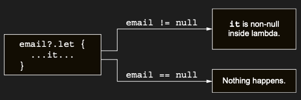

# Dealing with nullable expressions: The let function

let function’ı, nullable expression’larla başa çıkmayı kolaylaştırır. Safe-call operator ile birlikte kullanıldığında,
bir expression’ı evaluate etmene, sonucu null için check etmene ve sonucu bir variable’da saklamana olanak tanır;
üstelik hepsi tek ve concise bir expression içinde. En yaygın kullanım alanlarından biri, non-nullable bir parameter
bekleyen bir function’a geçirilmesi gereken nullable bir argument’ı ele almaktır. sendEmailTo function’ının String
type’ında tek bir parameter aldığı ve bu adrese bir e-posta gönderdiğini varsayalım. Bu function Kotlin’de yazılmıştır
ve non-nullable bir parameter gerektirir:

```kotlin
fun main() {
    val email: String? = "foo@bar.com"
    // sendEmailTo(email)
    // ERROR: Type mismatch: inferred type is String? but String was expected
}

// Bu function’a nullable type’a sahip bir value pass edemezsin:
fun sendEmailTo(email: String) = println("Sending to : $email")
```

Bu value’nun null olmadığını açıkça check etmen gerekir:

```kotlin
fun main() {
    val email: String? = "foo@bar.com"
    if (email != null) sendEmailTo(email)
}

// Bu function’a nullable type’a sahip bir value pass edemezsin:
fun sendEmailTo(email: String) = println("Sending to : $email")
```

Ancak başka bir yol izleyebilirsin: let function’ını kullanıp onu safe-call ile call etmek. let function’ının yaptığı
tek şey, call edildiği object’i lambda’nın bir parameter’ı hâline getirmektir. Bu yönüyle, 5.4 bölümünde tanıdığın diğer
scope function’lara benzer. Ancak safe-call syntax’ı ile birlikte kullanıldığında, üzerinde let call edilen nullable
type’taki bir object’i etkili bir şekilde non-nullable type’a dönüştürür:

Safe-call operator ile birlikte kullanıldığında, let, yalnızca expression null değilse execute edilen bir lambda
belirtmene olanak tanır. Bu, özellikle nullable olabilen bir expression zincirinin result’ı ile çalışırken son derece
kullanışlıdır.



```kotlin
fun main() {
    val email: String? = "foo@bar.com"
    email?.let { email -> sendEmailTo(email) } // Sending to : foo@bar.com
}

// Bu function’a nullable type’a sahip bir value pass edemezsin:
fun sendEmailTo(email: String) = println("Sending to : $email")
```

Otomatik olarak oluşturulan it ismini kullanan kısa syntax’a geçildiğinde, sonuç çok daha concise olur:

```kotlin
email?.let { sendEmailTo(it) }
``` 

İşte bu pattern’i gösteren daha kapsamlı bir örnek.

```kotlin
fun main() {
    var email: String? = "yole@example.com"

    email?.let { sendEmailTo(it) }
    //Sending to : yole@example.com

    email = null
    email?.let { sendEmailTo(it) }
    // hiçbirşey yapmaz
}

fun sendEmailTo(email: String) = println("Sending to : $email")
```

let notasyonunun, null değilse daha uzun bir expression’ın value’sunu kullanman gerektiğinde özellikle kullanışlı
olduğunu unutma. Bu durumda ayrı bir variable oluşturmak zorunda kalmazsın. Bu explicit if check’i ile karşılaştır:

```kotlin
val person: Person? = getTheBestPersonInTheWorld()
if (person != null) sendEmailTo(person.email)
```

ek bir variable olmadan yazılmış aynı code ile:

```kotlin
getTheBestPersonInTheWorld()?.let { sendEmailTo(it.email) }
```

Bu function null döndürür; bu nedenle lambda içindeki code hiçbir zaman execute edilmeyecektir.

```kotlin
fun getTheBestPersonInTheWorld(): Person? = null
```

Birden fazla value’yu null için check etmen gerektiğinde, bunları ele almak için nested let call’ları kullanabilirsin.
Ancak çoğu durumda, bu tür code oldukça verbose olur ve takip etmesi zorlaşır. Genellikle tüm value’ları birlikte check
etmek için normal bir if expression kullanmak daha kolaydır.

### Comparing Kotlin’s scope functions: When to use with, apply, let, run, and also

Son birkaç bölümde, çok benzer signature’lara sahip birden fazla function’a ayrıntılı bir şekilde baktın: with, apply,
let, run ve also. Tüm bu scope function’ları, bir object’in context’inde bir code bloğu execute eder. Lambda içinde söz
konusu object’e nasıl referans verildiği ve return value’ları bakımından farklılık gösterirler:


Farkları oldukça inceciktir. Bu nedenle, her birinin özellikle uygun olduğu task’ları bir kez daha belirtmek faydalıdır,
böylece yan yana karşılaştırabilirsin:

* Safe-call operator ?. ile birlikte let kullanarak, üzerinde çalıştığın object null değilse bir code bloğunu execute
  et. Bağımsız bir let kullanarak, bir expression’ı lambda scope’u ile sınırlı bir variable hâline getir.

* apply kullanarak, object’in property’lerini builder-style API ile configure et (ör. bir instance oluştururken).

* also kullanarak, object’ini kullanan ek action’ları execute et ve orijinal object’i sonraki zincirlenmiş
  operation’lara geçir.

* with kullanarak, aynı object üzerinde yapılan function call’larını grupla ve object’in adını tekrar etmek zorunda
  kalma.

* run kullanarak, bir object’i configure et ve custom bir result compute et.

Farklı scope function’larının kullanımı, esas olarak detaylarda farklılık gösterir; bu nedenle birden fazla scope
function’ın uygun göründüğü bir durumda kendini bulabilirsin. Bu tür durumlar için, takımında veya projen için
kullanılan convention’larda anlaşmak mantıklıdır.

___
___

Diğer yaygın bir durum, aslında non-nullable olan ancak constructor’da non-null bir value ile initialize edilemeyen
property’lerdir. Kotlin’in bu durumla nasıl başa çıkmana izin verdiğine bakalım.