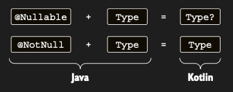

# Nullability and Java

Önceki tartışma, Kotlin dünyasında null value’larla çalışmak için kullanılan araçları kapsıyordu. Ancak Kotlin, Java
interoperability ile övünür ve Java’nın type system’ında nullability’yi desteklemediğini biliyorsun. Peki Kotlin ve
Java’yı birleştirdiğinde ne olur? Tüm safety’yi mi kaybedersin, yoksa her value’yu null için mi check etmen gerekir?
Yoksa daha iyi bir çözüm mü vardır? Hadi öğrenelim.

İlk olarak, belirttiğimiz gibi bazen Java code, annotation’lar kullanılarak ifade edilen nullability bilgisi içerir. Bu
bilgi code’da mevcut olduğunda Kotlin onu kullanır. Dolayısıyla Java’daki @Nullable String, Kotlin tarafından String?
olarak görülür ve @NotNull String ise sadece String’dir:

Annotation’lı Java type’lar, annotation’lara göre Kotlin’de nullable ve non-nullable type’lar olarak represent edilir.
Bu type’lar ya explicit olarak null value’ları tutabilir ya da explicit olarak non-nullable’dır.

Kotlin, JSR-305 standardından (javax.annotation package’ında), Android’e ait olanlardan (android.support.annotation) ve
JetBrains tool’ları tarafından desteklenenlerden (org.jetbrains.annotations) gelenler de dahil olmak üzere, nullability
annotation’larının birçok farklı flavor’ını tanır. İlginç soru, annotation’lar mevcut olmadığında ne olduğudur. Bu
durumda, Java type Kotlin’de bir platform type hâline gelir.