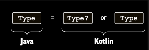
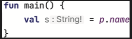

# Platform types

Platform type, esasen Kotlin’in nullability bilgisine sahip olmadığı bir type’tır; onunla nullable ya da non-nullable
bir type olarak çalışabilirsin.

Özel annotation’lar içermeyen Java type’lar, Kotlin’de platform type’lar olarak represent edilir. Onları ya nullable ya
da non-nullable type’lar olarak kullanmayı seçebilirsin.



Bu, tıpkı Java’da olduğu gibi, bu type ile gerçekleştirdiğin operations’lar için tüm responsibility’nin sende olduğu
anlamına gelir. Compiler tüm operations’lara izin verir. Ayrıca normalde non-nullable bir type’ın value’su üzerinde
null-safe bir operation gerçekleştirdiğinde yaptığı gibi, bu tür value’lar üzerindeki null-safe operations’ları
redundant olarak da highlight etmez. Eğer value’nun null olabileceğini biliyorsan, kullanmadan önce null ile compare
edebilirsin. Null olmadığını biliyorsan, onu doğrudan kullanabilirsin. Tıpkı Java’da olduğu gibi, bunu yanlış yaparsan
usage site’ında bir NullPointerException alırsın. Person class’ının Java’da declared edildiğini varsayalım.

```java
/* Java */
public class Person {
    private final String name;

    public Person(String name) {
        this.name = name;
    }

    public String getName() {
        return name;
    }
}
```

getName null döndürebilir mi yoksa döndürmez mi? Bu case’te Kotlin compiler, String type’ın nullability’si hakkında
hiçbir şey bilmez, bu yüzden onunla kendin ilgilenmen gerekir. Eğer name’in null olmadığından eminsen, Java’daki gibi,
ek check’ler olmadan onu normal şekilde dereference edebilirsin. Ancak bu durumda bir exception almaya hazır ol.

```kotlin
fun main() {
    yellAt(Person(null))
    // java.lang.NullPointerException: person.name must not be null
}

fun yellAt(person: Person) {
    // uppercase() call’unun receiver’ı olan person.name null’dur, bu yüzden bir exception fırlatılır.
    println(person.name.uppercase() + "!!!")
}
```

Diğer seçeneğin, getName()’in return type’ını nullable olarak yorumlamak ve ona safe şekilde access etmektir.

```kotlin
fun main() {
    yellAtSafe(Person(null))
}

fun yellAtSafe(person: Person) {
    println((person.name ?: "Anyone").uppercase())
}
```

Bu example’da null value’lar doğru şekilde handle edilir ve run-time exception fırlatılmaz.

Java API’lerle çalışırken dikkatli ol. Kütüphanelerin çoğu annotation’lı değildir, bu yüzden tüm type’ları non-nullable
olarak yorumlayabilirsin; ancak bu hatalara yol açabilir. Hatalardan kaçınmak için, kullandığın Java method’larının ne
zaman null döndürebileceğini öğrenmek amacıyla documentation’ı (gerekirse implementation’ı da) kontrol etmeli ve bu
method’lar için check’ler eklemelisin.

### Why platform types?

Kotlin’in, Java’dan gelen tüm value’ları nullable olarak ele alması daha safe olmaz mıydı? Böyle bir design mümkün
olurdu, ancak Kotlin compiler bu bilgiyi göremeyeceği için, hiçbir zaman null olamayacak value’lar için çok sayıda
redundant null check gerektirirdi.

Bu durum özellikle generic’lerle çok daha kötü olurdu—örneğin, Java’dan gelen her ArrayList<String>, Kotlin’de
ArrayList<String?>? olurdu ve her access’te value’ları null için check etmen ya da bir cast kullanman gerekirdi; bu da
safety faydalarını ortadan kaldırırdı. Bu tür check’leri yazmak son derece can sıkıcıdır, bu yüzden Kotlin’in
tasarımcıları pragmatik seçeneği tercih etti ve Java’dan gelen value’ların doğru şekilde handle edilmesi
responsibility’sini developer’lara bıraktı.

___
___

Kotlin’de bir platform type variable declare edemezsin; bu type’lar yalnızca Java code’dan gelebilir. Ancak onları error
message’larda ve IDE’de görebilirsin:

```kotlin
val i: Int = person.name
// ERROR: Type mismatch: inferred type is String! but Int was expected
```

String! notasyonu, Kotlin compiler ve IntelliJ IDEA ile Android Studio gibi Kotlin IDE’lerinin, Java code’dan gelen
platform type’ları belirtmek için kullandığı gösterimdir:

Java property için type inference kullanılırken, Kotlin Types için inlay hints etkinse IntelliJ IDEA ve Android Studio,
bir platform type ile çalıştığını gösterir. Exclamation point, bu platform type’ları ilk bakışta fark etmeni sağlar.



Bu syntax’ı kendi code’unda kullanamazsın ve genellikle bu exclamation mark bir problemin kaynağıyla bağlantılı
değildir; bu yüzden çoğu zaman onu görmezden gelebilirsin. Sadece type’ın nullability’sinin unknown olduğunu vurgular.
Daha önce söylediğimiz gibi, platform type’ları istediğin şekilde yorumlayabilirsin—nullable ya da non-nullable
olarak—dolayısıyla aşağıdaki declaration’ların her ikisi de geçerlidir:

```kotlin
// Java’nın property’si nullable olarak görülebilir …
val s: String? = person.name

// yada non-null
val s1: String = person.name
```

Bu case’te, tıpkı method call’larda olduğu gibi, nullability’yi doğru ayarladığından emin olman gerekir. Java’dan gelen
null bir value’yu non-nullable bir Kotlin variable’a assign etmeye çalışırsan, assignment noktasında bir exception
alırsın. Java type’ların Kotlin’den nasıl görüldüğünü ele aldık. Şimdi karma Kotlin ve Java hierarchy’leri oluşturmanın
bazı pitfalls’ları hakkında konuşalım.