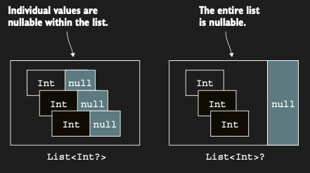
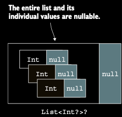

# Collections of nullable values and nullable collections

Chapter 7'de nullable type kavramını tartıştık, ancak type argument’ların nullability’sine sadece kısaca değindik. Oysa
bu, tutarlı bir type sistemi için esastır: bir collection null value tutabilir mi bilmek, bir variable’ın value’su null
olabilir mi bilmek kadar önemlidir. İyi haber, Kotlin’in type argument’lar için nullability’i tamamen desteklemesidir.
Nasıl ki bir variable’ın type’ına ? karakteri ekleyerek variable’ın null value tutabileceğini gösterebiliyorsak, type
argument olarak kullanılan bir type da aynı şekilde işaretlenebilir. Bunun nasıl çalıştığını görmek için, bir input text
alan ve input string’deki her satırı number olarak parse etmeye çalışan bir function örneğine bakalım.

```kotlin
fun readNumbers(text: String): List<Int?> {
    // Nullable Int value’lardan oluşan mutable bir liste oluşturur.
    val result = mutableListOf<Int?>()

    // Input string’i satır satır iterate eder.
    for (line in text.lineSequence()) {
        val numbersOrNull = line.toIntOrNull()

        //Current line parse edilemiyorsa listeye null ekler, aksi halde integer ekler.
        result.add(numbersOrNull)
    }
    return result
}

fun main() {
    val testString = """
        10
        twenty
        30
        61
        23
        sixty
    """.trimIndent()
    println(readNumbers(testString)) // [10, null, 30, 61, 23, null]
}
```

List<Int?>, Int? type’ına sahip value’ları tutabilen bir listedir—başka bir deyişle, Int veya null. Line parse
edilebiliyorsa integer’ı result listeye ekler, aksi halde null ekler.

Variable’ın type’ının nullability’sinin, type argument olarak kullanılan type’ın nullability’sinden farklı olduğunu fark
et. Nullable Int’lerden oluşan bir liste ile Int’lerden oluşan nullable bir liste arasındaki fark:

Collection’ı kullanma amacını nullability açısından dikkatle değerlendir. Tüm collection nullable mı olmalı, yoksa
collection içindeki bireysel element’ler mi nullable olmalı?



Soldaki -> Listedeki individual (bireysel) value’lar nullable’dır.

Sağdaki -> Listenin tamamı nullable’dır.

İlk durumda, liste her zaman non-null’dır, ancak listedeki her value null olabilir. İkinci type’a sahip bir variable,
bir liste instance’ı yerine null referans içerebilir, ancak listedeki element’lerin non-null olduğu garantilidir.

Bu arada, functional programming ve lambda bilgimizle, bu örneği map function’ını kullanarak aslında kısaltabiliriz; map
function’ını ilk olarak 6. bölümde görmüştük. Bu function, verilen function’ı—bu durumda toIntOrNull—input sequence’deki
her element’e uygular ve sonra bunları bir result listeye toplayabiliriz.

```kotlin
fun readNumbers(text: String): List<Int?> =
    text.lineSequence()
        .map { it.toIntOrNull() }
        .toList()

fun main() {
    val testString = """
        10
        twenty
        30
        61
        23
        sixty
    """.trimIndent()
    println(readNumbers(testString)) // [10, null, 30, 61, 23, null]
}
```

Bazen, nullable number’lardan oluşan nullable bir liste tutan bir variable declare etmek isteyebilirsin. Bu, listedeki
bireysel element’lerin olmayabileceğini, ancak listenin tamamının da olmayabileceğini ifade etmene olanak tanır.
Kotlin’de bunu yazmanın yolu List<Int?>? şeklindedir; iki soru işareti kullanılır:

Listenin tamamı ve içindeki individual (bireysel) value’lar nullable’dır. Nullable integer’lardan oluşan nullable bir
collection, kendisi null olabilir veya potansiyel olarak null olan element’ler içerebilir.



Inner soru işareti, listenin element’lerinin nullable olduğunu belirtir. Dıştaki soru işareti, listenin kendisinin
nullable olduğunu belirtir. Variable’ın value’sunu kullanırken olduğu gibi, listedeki her element’in value’sunu
kullanırken de null kontrolü uygulaman gerekir.

Nullable value’lardan oluşan bir liste ile nasıl çalışabileceğini görmek için, tüm geçerli number’ları toplayan ve
geçersiz number’ları ayrı sayan bir function yazalım.

```kotlin
fun readNumbers(text: String): List<Int?> =
    text.lineSequence()
        .map { it.toIntOrNull() }
        .toList()

fun addValidNumbers(numbers: List<Int?>) {
    var sumOfValidNumbers = 0
    var invalidNumbers = 0

    for (number in numbers) {
        if (number != null) sumOfValidNumbers += number else invalidNumbers++
    }

    println("Sum of valid numbers : $sumOfValidNumbers") // Sum of valid numbers : 124
    println("Invalid numbers : $invalidNumbers") // Invalid numbers : 2
}

fun main() {
    val testString = """
        10
        twenty
        30
        61
        23
        sixty
    """.trimIndent()

    val numbers = readNumbers(testString)
    addValidNumbers(numbers)
}
```

Burada pek özel bir şey yok. Listenin bir elementine eriştiğinde, Int? type’ında bir value elde edersin ve arithmetic
operation’larda kullanmadan önce null olup olmadığını kontrol etmen gerekir.

Nullable value’lardan oluşan bir collection’ı alıp null olanları filtrelemek o kadar yaygın bir operation’dır ki, Kotlin
bunu gerçekleştirmek için filterNotNull adlı bir standard library function sağlar. Önceki örneği büyük ölçüde
basitleştirmek için bunu nasıl kullanabileceğine bakalım.

```kotlin
fun readNumbers(text: String): List<Int?> =
    text.lineSequence()
        .map { it.toIntOrNull() }
        .toList()

fun addValidNumbers(numbers: List<Int?>) {
    val validNumbers = numbers.filterNotNull()

    println("Sum of valid numbers : ${validNumbers.sum()}") // Sum of valid numbers : 124
    println("Invalid numbers : ${numbers.size - validNumbers.size}") // Invalid numbers : 2
}

fun main() {
    val testString = """
        10
        twenty
        30
        61
        23
        sixty
    """.trimIndent()

    val numbers = readNumbers(testString)
    addValidNumbers(numbers)
}
```

Elbette, filtering aynı zamanda collection’ın type’ını da etkiler. validNumbers’ın type’ı List<Int>’tir; çünkü
filtering, collection’ın null element içermediğini garanti eder:

filterNotNull function’ı, input collection’daki tüm null element’leri kaldırarak yeni bir collection döndürür. Bu yeni
collection da non-nullable type’tadır; yani ileride ek null handling yapmak zorunda kalmazsın.


Artık Kotlin’in nullable ve non-null element’ler tutan collection’ları nasıl ayırt ettiğini anladın. Bir sonraki
bölümde, Kotlin’in getirdiği bir diğer önemli farka bakalım: read-only ve mutable collection’lar.